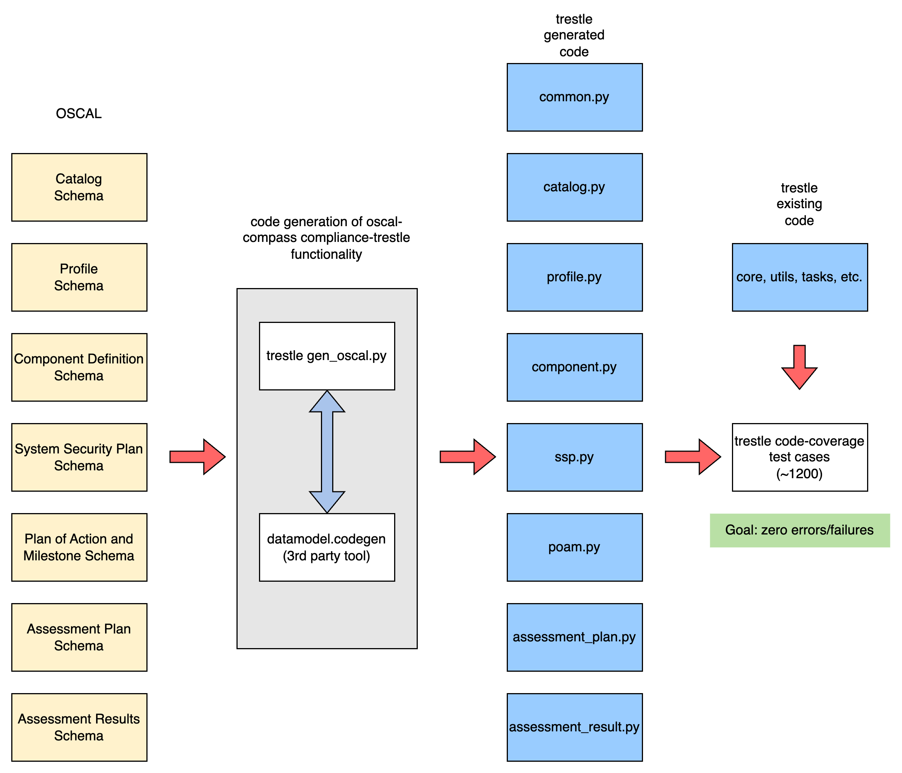

## Developers Guide to trestle upgrade commensurate with OSCAL models upgrade

This is a general guide on how to go about upgrading compliance-trestle to support a new version of OSCAL models.

The steps are as follows:

<ol>
<li> Create  in GitHub repo <i style="color:darkgrey;">(remote)</i>
<li> Clone upgrade branch into /trestle-upgrade folder <i style="color:darkgrey;">(local <- remote)</i>
<li> Download revised and new OSCAL models into folder /trestle-upgrade/release-schemas <i style="color:darkgrey;">(local <- remote)</i>
<ul>
<li> See <a href="https://github.com/usnistgov/OSCAL/releases">https://github.com/usnistgov/OSCAL/releases</a>
</ul>
<li> Create & source python virtual environment venv.trestle-upgrade <i style="color:darkgrey;">(local)</i>
<li> Orient current folder to /trestle-upgrade <i style="color:darkgrey;">(local)</i>
<li> Run make develop <i style="color:darkgrey;">(local)</i>
<li> Make necessary code changes:
<ul>
<li> Run python scripts/gen_oscal.py <i style="color:darkgrey;">(local)</i>
<li> Run make test-all <i style="color:darkgrey;">(local)</i>
<li> Fix errors and failures via modification of code generation modules and existing trestle modules, as appropriate case-by-case <i style="color:darkgrey;">(local)</i>
<li> Repeat until all errors and failures are fixed <i style="color:darkgrey;">(local)</i>
</ul>
<li> Run make code-format <i style="color:darkgrey;">(local)</i>
<li> Run make code-lint <i style="color:darkgrey;">(local)</i>
<li> Push /trestle-upgrade folder changes back to GitHub repo <i style="color:darkgrey;">(local -> remote)</i>
<li> Create PR for trestle-upgrade branch -> develop branch <i style="color:darkgrey;">(remote)</i>
<li> Get PR approval <i style="color:darkgrey;">(remote)</i>
<li> Merge PR into develop branch <i style="color:darkgrey;">(remote)</i>
<li> Create PR for develop branch -> main branch <i style="color:darkgrey;">(remote)</i>
<li> Create breaking change <i style="color:darkgrey;">(remote)</i>
<li> Get PR approval <i style="color:darkgrey;">(remote)</i>
<li> Merge develop branch into main branch <i style="color:darkgrey;">(remote)</i>
</ol>

______________________________________________________________________

##### Overview of process to take OSCAL models and upgrade trestle Python code

