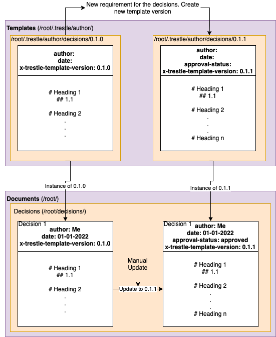

# Trestle CLI for Governance of Authored Documents

This document is organized in a multiple collapsable sections for ease of use.
Start by reading the overview and setting up the Trestle workspace and then proceed to other sections,
to learn more about Trestle authoring capabilities.

## Contents

<details markdown>

<summary><b>1. Overview</b></summary>

## Overview

The premise of trestle is to support managing compliance artifacts as code.
When this is considered, many organisations using `{github|gitlab|bitbucket}` rely on markdown documents for documentary artifacts that may either directly or indirectly support compliance efforts.

To support this, trestle has the concept of 'governing' documents that are authored documents: Where structural conditions are enforced on the markdown documents to allow automation and to ensure business processes are met.

Living in the `GitOps` world this capability is anchored with `markdown` files as the core of the workflows. Currently `drawio` files are also supported for a subset of enforcement mechanisms.

### Why is this capability in trestle?

While trestle provides editing support for OSCAL there is an unfortunate truth that for some compliance workflows:

1. OSCAL does not cover the lower level operational workflows.
1. Some users will not be comfortable editing in json/yaml/xml formats

The markdown centric workflows allow transition path where capability is [being developed](https://github.com/IBM/compliance-trestle/issues/555)

</details>

<details markdown>

<summary><b>2. Setting up the Trestle workspace</b></summary>

## Setting up the Trestle workspace

To work with governed documents, you would need to initialize the Trestle workspace and create your first governed document
and template.

To create a trestle workspace that will contain all your templates and governed documents:

```bash
mkdir my_workspace
cd my_workspace
trestle init --govdocs
>>> Initialized trestle project successfully in [user_path]/my_workspace
```

The templates will be located in the `/my_workspace/.trestle/author/`. Please note that if you use MacOS or Linux distribution, by default `.trestle` will be hidden. You will need to reconfigure your system to show hidden folders if you want to see them listed.

</details>

<details markdown>

<summary><b>3. Authoring of Documents</b></summary>

<details markdown>

<summary><b>Documents Structural Enforcement</b></summary>

## Markdown structural enforcement

Trestle templating enforces the documents to follow a specific structure. There are two ways in which structure is enforced in a document against template:

1. Enforcing a YAML header (metadata) structure at the top of the markdown document.
1. Enforcing a heading structure within the markdown document.

Each document is validated against a specific template, see CLI section below on information on how to specify which template the document should be validated against.

### Enforcing YAML header (metadata) structure

Each template and document contains metadata in form of a YAML header that is placed on top.
When the document is created (i.e. `trestle docs setup`) the metadata is copied from the template to the newly created document.

Below is an example of a markdown file that contains YAML header:

```markdown
---
groceries:
grocery1:
  name: apple
  type: fruit
  bought-in: Local market
grocery2:
  name: potato
  type: vegetable
  bought-in: Local market
date: 01-01-2022
not-important-field: not important
x-trestle-version: 1.0.0
x-trestle-ignore: not-important-field, bought-in
---
# The rest of my document
```

Each field in the YAML header follows the `key: value` format.
For YAML header we validate the structure and the presence of the "keys" and not the "values".

The document YAML header(metadata) is said to be **_valid_** against the template, if and only if:

1. It contains **all** keys from the template EXCEPT the keys that either:
   1. Start with `x-trestle`
   1. Are listed under the `x-trestle-ignore` key (i.e. `x-trestle-ignore: not-important-field, bought-in`)
1. The version under `x-trestle-template-version: ` key is matching the template.
1. No new keys were added to the document.

For example, this change to the YAML header above is acceptable:

```markdown
---
groceries:
  grocery1:
      name: pear
      type: fruit
      bought-in: Superstore
  grocery2:
      name: potato
      type: vegetable
      bought-in: Local market
date: 10-10-2023
not-important-field: not important
x-trestle-version: 1.0.0
x-trestle-ignore: not-important-field, bought-in
---
# The rest of my document
```

### Enforcing heading structure

Markdown headings are considered to be nested based on the heading level (i.e. number of `#`). For example, `## 1.1 Lower level heading` is below `# 1. top level heading`.

The document body is said to be **_valid_** against the template, if and only if,

1. It contains **_all_** the headings provided in the template.
1. No new headings were added at the top level (i.e. `# New heading` is not allowed).
1. All original headings are in the same order as in the template.
1. All headings must be in the hierarchical order (i.e. `# Heading` then `### Heading` then `## Heading` is invalid).
1. If the `--governed-heading` option is provided, then document is valid if no keys has changed in the specified governed section.

For example, consider this template as our starting point:

```markdown
# Template heading 1
Some text
# Template heading 2
## Template sub heading
```

Now we added new sections and ended up with the following document:
(note: this document will be valid against the template above)

```markdown
# Template heading 1
Content for heading one
## Non-required sub header
Content for non-required sub header
# Template heading 2
Content for heading two
## Template sub heading
Content for template sub heading
### non required sub-sub heading
This sub-sub heading is okay
```

However, violations such as adding or removing a heading at the top level are not acceptable:

```markdown
# Template heading 1
Content for heading one
## Non-required sub header
Content for non-required sub header
# Template heading 2
Content for heading two
## Template sub heading
Content for template sub heading
# Top level heading that is not okay <<< NOT OKAY
```

For each of the headings - the text of the heading is enforced with one caveat:

- If the template heading text is wrapped in curly brackets `{}` then the name is not measured e.g. `# {Insert title here}`.

## Drawio enforcement mechanisms

Drawio or [diagrams.net](https://app.diagrams.net/) is a diagramming platform which has significant use for architecture diagrams. In the context of governance of content, trestle is supporting enforcement of metadata.

Drawio (or `mxgraph`) files have a set of data fields. In a drawio file this is available in the edit menu as *edit data*. The diagram below shows how to access the (meta)data.


The data presents as a set of key-value pairs which can be edited (see below). The data is bound to each tab in a drawio file. The trestle CLI currently expects that metadata (whether from the template or file to be measured) is in the first tab when editing the draw io file.


</details>

<details markdown>

<summary><b>Setting Up Templates and Documents Via CLI</b></summary>
Trestle allows the setup of templates and governed documents in a several different ways based on the nature of the needed governance.

Definitions used in this section:

- _**document**_ - a markdown or drawio file that needs to be validated against some template.
- _**template**_ - an individual markdown or drawio file containing metadata and/or headings against which the documents will be validated.
- _**task**_ - a name of the folders containing documents and their respective templates.
- _**template folder**_ - an individual folder containing the templates that documents needs to be validated against.

You can set up multiple different tasks and types of validations in the same workspace.

Setup Trestle for:

<details markdown>

<summary><b>docs - Validating documents against one specific template (one template per task)</b></summary>

## Validating documents against one specific template

In this section we describe the functionality of `trestle author docs` command.

`author docs` is designed to support enforcing and generating templating markdown files within a single folder based on a task name. Currently `author docs` supports markdown files only.

### Creating new task/template

To create a new task with the necessary directory structures for running governed docs validation, run:

> trestle author docs setup -tn my_task_name

This will create a template folder and a single template: `TRESTLE_ROOT/.trestle/author/my_task_name/0.0.1/template.md`.
As well as an empty document folder: `TRESTLE_ROOT/my_task_name/`
The template will be applied to **all** markdown files in the task i.e.: `TRESTLE_ROOT/my_task_name/*.md`.

#### Extra options

- You can create different versions of the template by specifying the version via `--template-version` flag. See `Template Versioning` section for more information.
  By default if no version is provided `0.0.1` will be used.

### Creating new document for the task

To create a new document that confirms to a template run:

> trestle author docs create-sample -tn my_task_name

This will create a sample document in: `TRESTLE_ROOT/my_task_name/my_task_name_000.md`.
Once created this document will be a complete copy of the template, however you can modify this file with your own content.

#### Extra options

- This command has no extra options

### Validating the template

To ensure that the markdown in the template is parseable run:

> trestle author docs template-validate -tn my_task_name

#### Extra options

- If `--governed-heading 'heading name'` (`-gh`) is passed it ensures that the required heading exists.
- If `--header-validate` (`-hv`) is passed the header will be validated as well.
- If `--header-only-validate` (`-hov`) only the header and NOT the body will be validated

### Validating the documents against the template

To validate the documents against a template run:

> trestle author docs validate -tn my_task_name

This will take the `TRESTLE_ROOT/.trestle/author/my_task_name/template.md` template and validate all markdown files here: `TRESTLE_ROOT/my_task_name/*.md`.

Running the command will validate that markdown body in the document is valid against the template. Please note that by default the header will **not** be validated.
See extra options for more validation options. To learn more on what exactly is validated please refer to `Documents Structural Enforcement` section in this document.

#### Extra options

- If `--governed-heading` (`-gh`) is passed it will ensure that the governed content was not modified. Governed content comes in the **key:** value format:

```markdown
     # Governed section
     **Content Type:**  Foo
     **Author(s):**  Bah
     **Executive Owner:**  Stuff
     **Technical Approver:**   John Doe (approved)
     **Version:** 1.0.1
```

Running `trestle author docs validate -tn docs_task -gh="Governed section"` will ensure this content is present in the document.

- If `--ignore ^_.*` (`-ig`) is passed it will validate all files except folders and files that start with underscore `_`. Use this option when you would like to ignore any folders or files that match given regular expression.
- If `--header-validate` (`-hv`) is passed the header will be validated as well.
- If `--header-only-validate` (`-hov`) is passed only the header and NOT the body will be validated.
- If `--readme-validate` (`-rv`) is passed README.md will be validated as well, otherwise it is ignored.
- If `--recurse` (`-r`) is passed the documents in the subfolders will also be validated. By default `author docs` only indexes a flat directory.
- If `--template-version 1.0.0` (`-tv`) is passed the header field `x-trestle-template-version` will be ignored and document will be forcefully validated against template of version `1.0.0`.
  Use this for testing purposes _only_ when you need to validate the document against a specific template. By default the template version will be determined based on `x-trestle-template-version` in the document.

</details>

<details markdown>

<summary><b>folders - Validating documents against multiple templates and ensuring folder structure (multiple individual templates per task) </b></summary>

## Validating against multiple templates

In this section we describe the functionality of `trestle author folders` command.

`author folders` is designed to allow the assembly of groups of templates where each folder contains unique content.
This command will validate that both: structure (i.e. all template documents are present) and content is preserved in the folder. Trestle author folders supports validation of both markdown and drawio files. Note that headers / metadata must be specified in each applicable template.

### Creating new task folder

To create a new task folder run:

> trestle author folders setup -tn my_task_2

This will create a template folder with the following structure:

```text
trestle_root
┣ .trestle
┃ ┣ author
┃ ┃ ┣ my_task_2
┃ ┃ ┃ ┣ 0.0.1
┃ ┃ ┃ ┃ ┣ a_template.md
┃ ┃ ┃ ┃ ┣ another_template.md
┃ ┃ ┃ ┃ ┗ arhitecture.drawio
┃ ┗ config.ini
```

Each task folder is required to meet template requirements for all: `a_template.md`, `another_template.md`, and `template.drawio`. The names, numbers, and nesting of folders is user specifiable, however, unlike `docs` the names must be carried over to each instances.

#### Extra options

- You can create different versions of the template by specifying the version via `--template-version` flag. See `Template Versioning` section for more information.
  By default if no version is provided `0.0.1` will be used.

### Creating new documents for the task

Following the similar structure of `docs`, measurement occurs in the `my_task_2` where this structure is enforced for every directory.

To create a new folder with documents for the task run:

> trestle author folders create-sample -tn my_task_2

This will create a subfolder in the `my_task_2` with the same content as in template folder. Running it twice will result in:

```text
trestle_root
 ┣ .trestle
 ┣ my_task_2
 ┃ ┣ sample_folder_0
 ┃ ┃ ┣ a_template.md
 ┃ ┃ ┣ arhitecture.drawio
 ┃ ┃ ┗ another_template.md

 ┃ ┗ sample_folder_1
 ┃ ┃ ┣ a_template.md
 ┃ ┃ ┣ arhitecture.drawio
 ┃ ┃ ┗ another_template.md
```

#### Extra options

- This command has no extra options

### Validating the templates

To validate the documents against the template run:

> trestle author folders template-validate -tn my_task_2

This will ensure that the respective template files are parseable.

#### Extra options

- This command has no extra options

### Validating the documents against templates

The validation in `trestle author folder` runs similarly as in `docs` but now each document will be validated against the template with the same name as in the template folder.

To validate the documents against their respective templates, run:

> trestle author folders validate -tn my_task_name

This will validate all files. Please note that all files from the template folder must be present in the individual document folders.

#### Extra options

- If `--governed-heading` (`-gh`) is passed it will ensure that the governed content was not modified. Governed content comes in the **key:** value format:
  ```markdown
     # Governed section
     **Content Type:**  Foo
     **Author(s):**  Bah
     **Executive Owner:**  Stuff
     **Technical Approver:**   John Doe (approved)
     **Version:** 1.0.1
  ```

Running `trestle author docs validate -tn docs_task -gh="Governed section"` will ensure this content is present in the document.

- If `--ignore ^_.*` (`-ig`) is passed it will validate all files except folders and files that start with underscore `_`. Use this option when you would like to ignore any folders or files that match given regular expression.
- If `--header-validate` (`-hv`) is passed the header will be validated as well.
- If `--header-only-validate` (`-hov`) is passed only the header and NOT the body will be validated.
- If `--readme-validate` (`-rv`) is passed README.md will be validated as well, otherwise it is ignored.
- If `--recurse` (`-r`) is passed the documents in the subfolders will also be validated. By default `author docs` only indexes a flat directory.
- If `--template-version 1.0.0` (`-tv`) is passed the header field `x-trestle-template-version` will be ignored and document will be forcefully validated against template of version `1.0.0`.
  Use this for testing purposes _only_ when you need to validate the document against a specific template. By default the template version will be determined based on `x-trestle-template-version` in the document.

</details>

<details markdown>

<summary><b>headers - Validate only the headers against a global or a specific template </b></summary>

## Validate only the headers against a global or a specific template.

In this section we describe the functionality of `trestle author headers` command.

Trestle author headers supports a slightly different usecase than that of `docs` and `folders` above as only the YAML headers will be validated.
This command can be useful when one does not care about the markdown structure and might want to use global templates (templates that are shared across multiple tasks).

With `headers` template folder can contain both .md and .drawio files and each file will be validated against the template that matches the extension.
Also `headers` allow user to have `global` templates that can be shared across multiple tasks.

### Creating new task/template

To create a new task run:

> trestle author headers setup -tn my_task_3

This will create a template folder with the following format:

```text
trestle_root
┣ .trestle
┃ ┣ author
┃ ┃ ┣ my_task_3
┃ ┃ ┃ ┣ 0.0.1
┃ ┃ ┃ ┃ ┣ template.md
┃ ┃ ┃ ┃ ┗ template.drawio
┃ ┗ config.ini
```

#### Extra options

- If `--global` (`-g`) is passed then `__global__` then it will create `trestle_root/.trestle/author/__global__` folder. Use this when you would like to use same template for multiple tasks.
  ```text
  trestle_root
  ┣ .trestle
  ┃ ┣ author
  ┃ ┃ ┣ __global__
  ┃ ┃ ┃ ┣ 0.0.1
  ┃ ┃ ┃ ┃ ┣ template.md
  ┃ ┃ ┃ ┃ ┗ template.drawio
  ┃ ┗ config.ini
  ```
- You can create different versions of the template by specifying the version via `--template-version` flag. See `Template Versioning` section for more information.
  By default if no version is provided `0.0.1` will be used.

### Creating new documents

As of now this command does not support the automatic creation of the sample documents.

### Validating the templates

To validate the documents against the template run:

> trestle author headers template-validate -tn my_task_3

This will ensure that the respective template files are parseable.

#### Extra options

- This command has no extra options

### Validating the documents

To validate the documents against the template run:

> trestle author headers validate -tn my_task_3

This will validate all files within the directory against the templates (of the matching task name) by matching the extensions.
Please note that **only** headers will be validated. There is no option to validate the body.

### Extra options

- If `--global` (`-g`) is passed it will create `trestle_root/.trestle/author/__global__` folder. Use this when you would like to use same template for multiple tasks.
- If `--ignore ^_.*` (`-ig`) is passed it will validate all files except folders and files that start with underscore `_`. Use this option when you would like to ignore any folders or files that match given regular expression.
- If `--readme-validate` (`-rv`) is passed README.md will be validated as well, otherwise it is ignored.
- If `--recurse` (`-r`) is passed the documents in the subfolders will also be validated. By default `author docs` only indexes a flat directory.
- If `--template-version 1.0.0` (`-tv`) is passed the header field `x-trestle-template-version` will be ignored and document will be forcefully validated against template of version `1.0.0`.
  Use this for testing purposes _only_ when you need to validate the document against a specific template. By default the template version will be determined based on `x-trestle-template-version` in the document.

</details>

</details>

<details markdown>

<summary><b>Template Versioning</b></summary>

## Template versioning

### Prerequisite:

This section assumes that you have an existing Trestle workspace initialized, with existing template and governed documents.
Please follow steps in the section `Setting up the Trestle Workspace` if you don't have one.

Trestle provides the capability to version the templates and the documents via `x-trestle-template-version` field in the header.

Consider an example where we have a governed document called `Decision 1` that we now need to update to contain a new header field `approved-status` and a new required heading `Heading n` at the end, as demonstrated in the Figure below:


The intended workflow in this scenario is to:

1.Create a new version of the `decisions` template:

```bash
cd my_workspace 
trestle author docs setup -tn decisions -tv 0.1.1
>>> Set template version to 0.1.1.
>>> Template file setup for task decisions at .trestle/author/decisions/0.1.1/template.md
>>> Task directory is decisions
```

Add the new required content to the newly created template. In our example simply copy-paste all content from the `.trestle/author/decisions/0.1.0/template.md` and add the newly required fields.

2.Create a new instance of that template.

```bash
trestle author docs create-sample -tn decisions -tv 0.1.1
>>> Set template version to 0.1.1.
```

This step will create a copy of the template of version 0.1.1.

Now you will need to fill the documents with the updated information and new fields.

3.(Optional) Delete the old document.

Now that you have a new version of the document, you can delete the old one if you no longer need it. You can also keep it if you would like to maintain a history of updates.

4.Run validation.

After filling the contents to the new version of the template, you can run the validation to ensure that everything works as expected.

```bash
trestle author docs validate -tn decisions
>>> Instances will be validated against template version specified in their headers.
>>> VALID: decisions/decision_000.md
```

</details>

</details>
</details>
<details markdown>

<summary><b>4. Authoring of OSCAL Models</b></summary>

## OSCAL Authoring

### Catalog authoring

CLI evocation:

1. To generate markdowns for editing a catalog

> trestle author catalog-generate

2. To assemble markdowns to a JSON catalog

> trestle author catalog-assemble

The `catalog` author commands allow you to convert a control catalog to markdown and edit its control statement, then assemble markdown back into an OSCAL catalog with the modifications to the statement.  Items in the statement may be edited or added.  For more details on its usage please see [the catalog authoring tutorial](https://ibm.github.io/compliance-trestle/tutorials/ssp_profile_catalog_authoring/ssp_profile_catalog_authoring).

### Profile authoring

CLI evocation:

1. To generate markdowns for editing a profile

> trestle author profile-generate

2. To assemble markdowns to a JSON profile

> trestle author profile-assemble

The `profile` author commands allow you to edit additions made by a profile to its imported controls that end up in the final resolved profile catalog.  Only the additions may be edited or added to the generated markdown control files - and those additions can then be assembled into a new version of the original profile, with those additions.  For more details on its usage please see [the profile authoring tutorial](https://ibm.github.io/compliance-trestle/tutorials/ssp_profile_catalog_authoring/ssp_profile_catalog_authoring).

### SSP authoring

CLI evocation:

1. To generate markdowns for editing SSP

> trestle author ssp-generate

2. To assemble markdowns to a JSON SSP

> trestle author ssp-assemble

The `ssp-generate` sub-command creates a partial SSP (System Security Plan) from a profile and optional yaml header file.  `ssp-assemble` can then assemble the markdown files into a single json SSP file.

For more details on its usage please see [the ssp authoring tutorial](https://ibm.github.io/compliance-trestle/tutorials/ssp_profile_catalog_authoring/ssp_profile_catalog_authoring).

### SSP Content Filtering

CLI evocation:

> trestle author ssp-filter

The `ssp-filter` sub-command takes a given SSP and filters its contents based on a given profile, list of components, and/or control implementation status.

If filtering by profile, the SSP is assumed to contain a superset of controls needed by the profile, and the filter operation generates a new SSP with just the controls needed by that profile.  If the profile references a control not in the SSP, the routine fails with an error.

If filtering by components, a colon-delimited list of components should be provided, with `This system` as the default name for the overall required component for the entire system.  Case and spaces are ignored in the component names, so the names could be specified as `--components "this system: my component"`.  The resulting, filtered ssp will have updated implementated requirements with filtered by_components on each requirement, and filtered by_components on each statement.

If filtering by control implementation status, a comma-demilited list of implementation status values should be provided. These values must comply with the OSCAL SSP format references's allowed values, which are as follows: implemented, partial, planned, alternative, and not-applicable.

You may filter by a combination of a profile, list of component names, and implementation statuses.

As with the other related author commands, if an existing destination file already exists, it is not updated if no changes would be made.

For more details on its usage please see [the ssp-filter tutorial](https://ibm.github.io/compliance-trestle/tutorials/ssp_profile_catalog_authoring/ssp_profile_catalog_authoring).

</details>
