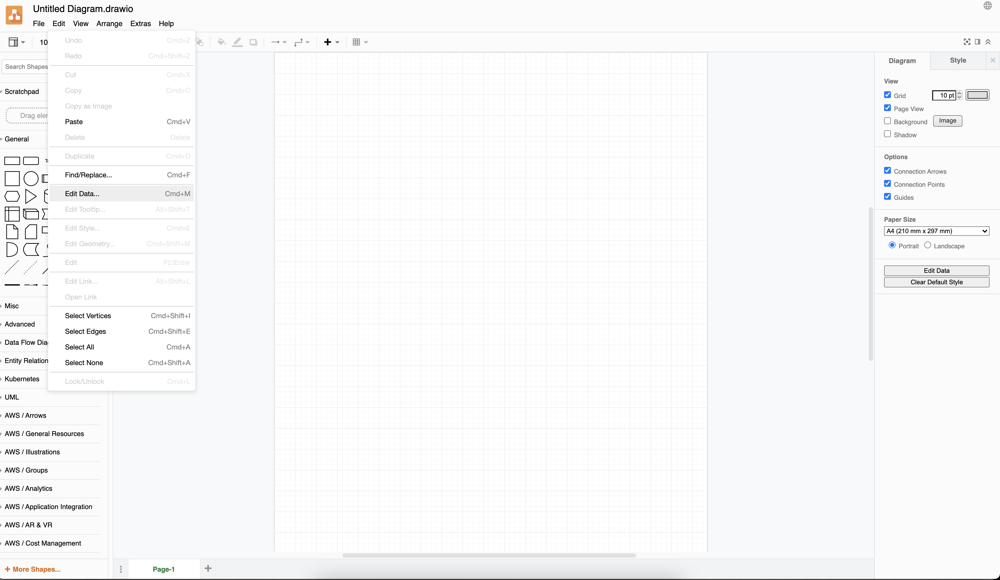
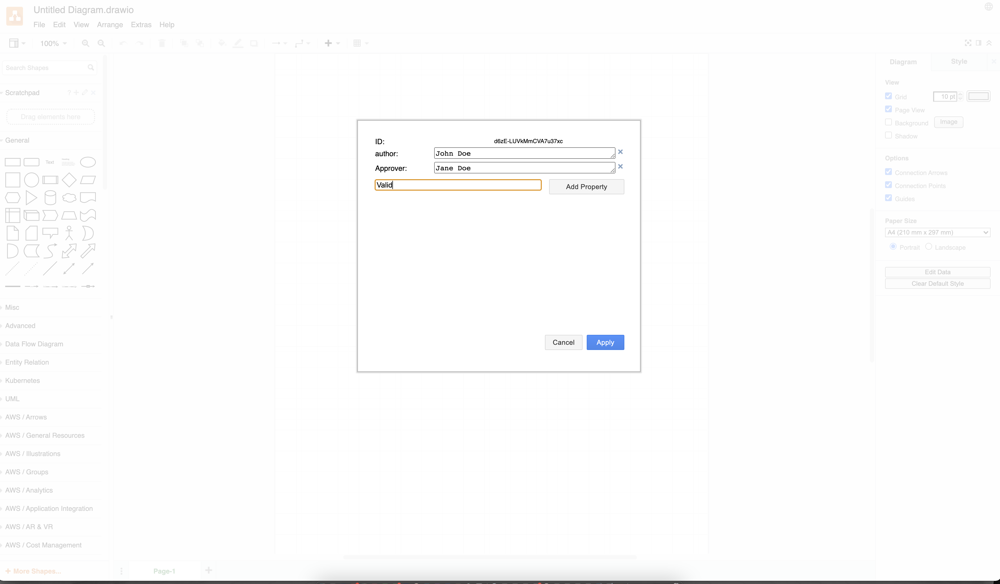

# trestle CLI for governance of authored documents

## Overview

The premise of trestle is to support managing compliance artifacts as code.
When this is considered, many organisations using `{github|gitlab|bitbucket}` rely on markdown documents for documentary artifacts that may either directly or indirectly support compliance efforts.

To support this trestle has the concept of 'governing' documents that are authored documents: Where structural conditions are enforced on the markdown documents to allow automation and to ensure business processes are met.

Living in the `GitOps` world this capability is anchored with `markdown` files as the core of the workflows. Currently `drawio` files are also supported for a subset of enforcement mechanisms.

### Why is this capability in trestle?

While trestle provides editing support for OSCAL there is an unfortunate truth that for some compliance workflows:

1. OSCAL does not cover the lower level operational workflows.
1. Some users will not be comfortable editing in json/yaml/xml formats

The markdown centric workflows allow transition path where capability is [being developed](https://github.com/IBM/compliance-trestle/issues/555)

## Governance mechanisms

### Markdown structural enforcement

In order for trestle to enforce structure an approach has been taken for how to template markdown documents. There are two mechanism that are enforced:

1. Enforcing a heading structure within the markdown document:
1. Enforcing a structured header within the markdown document either by using yaml headers or a designated heading.

For enforcing the heading structure the mechanism used is the following:

Markdown headings `As an example` are considered to be nested based on the heading level (e.g. ` heading` is below ` top level heading`).

For a document to contain the structural requirements it must contain all the headings provided in the template, however, can contain additional nested templates. Given this template:

```markdown
# Template heading 1

# Template heading 2
## Template sub heading
```

The following document is acceptable:

```markdown
# Template heading 1
Content for heading one
## Non-required sub header
Content for non-required sub header
# Template heading 2
Content for heading two
## Template sub heading
Content for template sub heading
### non required sub-sub heading
This sub-sub heading is okay
```

However, violations such as adding or removing a heading at a level that has been templated is not acceptable e.g.:

```markdown
# Template heading 1
Content for heading one
## Non-required sub header
Content for non-required sub header
# Template heading 2
Content for heading two
## Template sub heading
Content for template sub heading
## sub heading that violates template
This sub heading is NOT okay
# Top level heading that is not okay
```

For each of the headings - the text of the heading is enforced with one caveat:

- If the template heading text is wrapped in curly brackets `{}` then the name is not measured e.g. `# {Insert title here}`.

### Strict header / heading conformance mechanisms

Two mechanisms are provided to enforce metadata within markdown documents. The first is the yaml header, as used by technologies such as jekyll, the second is a markdown 'governed heading\` where templating of the content is enforced.
Use of the yaml header is strongly encouraged as a first preference.

```markdown
---
yaml:
    header:
        - with some 
        - structure
    more: information
---
# The rest of my document
```

The yaml header is structurally enforced my measuring whether the template key structure is reflected in the measured document. It does not measure values for yaml attributes. For the above markdown document the array value for `yaml.header` could be replaced with a single value or expanded. Enforcing the yaml header is enabled by `-hv` where available.

For enforcing a governed heading the structural enforcement mechanism assumes that the `key:value` structure simply takes the form that following that for each line of content under the chosen heading the template content is a subset of the measured document, in the order provided in the template. This is performed after removing formatting (such as bolding), and any HTML comments.

Given:

```markdown
# heading for strict enforcement
my_key:
**my_key_2:**
my_other key with strange stuff??
```

The following heading would be acceptable.

```markdown
# heading for strict enforcement
my_key: my value
my_key_2: my value
my_other key with strange stuff?? my value
```

This capability, where available, is activated by `--governed-heading` or `-gh`

### Drawio enforcement mechanisms

Drawio or [diagrams.net](https://app.diagrams.net/) is a diagramming platform which has significant use for architecture diagrams. In the context of governance of content trestle is supporting enforcement of metadata.

Drawio (or `mxgraph`) files have a set of data fields. In a drawio file this is available the edit menu as *edit data*. The diagram below shows how to access the (meta)data.



The data presents as a set of key-value pairs which can be edited (see below). The data is bound to each tab in a drawio file. The trestle CLI currently expects that metadata (whether from the template or file to be measured) is in the first tab when editing the draw io file.



## `trestle author governed-docs`

`author docs` is designed to support enforcing and generating templating markdown files within a single folder based on a task name. Currently `author docs` supports markdown files only.

`trestle author docs setup -tn my_task_name` Create the necessary directory structures for running governed docs validation.
A template file will be created in `TRESTLE_ROOT/.trestle/author/my_task_name/template.md` and be applied to all markdown files here: `TRESTLE_ROOT/my_task_name/*.md`.

`trestle author docs create-sample -tn my_task_name` Creates a sample file in `TRESTLE_ROOT/my_task_name/`

`trestle author docs template-validate -tn my_task_name` Ensures that the markdown is parseable. If `--governed-heading 'heading name'` is passed it ensures that the required heading exists.

`trestle author docs validate -tn my_task_name` validates the markdown, optionally with a `--governed-heading` or `-hv` yaml header based on this `TRESTLE_ROOT/.trestle/author/my_task_name/template.md` template to all markdown files here: `TRESTLE_ROOT/my_task_name/*.md`.

`trestle author docs validate -tn my_task_name -ig ^_.*` will validate all files except folders and files that start with underscore `_`. Use option `-ig` or `--ignore` when you would like to ignore any folders or files that match given regular expression.

### Extra options

#### recursive (`-r`, `--recurse`)

By default `author docs` only indexes a flat directory. The recursive option allows the markdown files to be nested in sub-directories.

#### Header only validation (`-hov`, `--header-only-validate`)

Turns off the validation of the structure of the document and only validates the yaml header structure.

#### Ignore files or folders from validation (`-ig`, `--ignore`)

Provide regular expression after this flag to ignore folders and files which names match this regular expression during **validation only**.

#### Template version tracking (`-tv`, `--template-version`)

This, along with the use of x-trestle-template-version in the governed header allows for repos using author templates
to implement support for multiple versions of templates. The x-trestle-template-version header represents the version
of the template used to create an instance document. With this change, the Version header specifically refers to the
version _of that document_ (be it an instance or the template itself). This means:

- For a template, if the x-trestle-template-version header exists, then it and the Version header of that template must
  always match. Further, the template's path needs to include the value stored in the x-trestle-template-version.
- For an instance, the Version header should not be compared with the Version header of the template. Rather,
  the x-trestle-template-version header should be compared with the x-trestle-template-version header of the template.

## `trestle author folders`

\`author folders is designed to allow the assembly of groups of templates where the folder assembly is the unique instance. Trestle author folders supports validation of both markdown and drawio files. Note that headers / metadata must be specified in each applicable template.

For example given the following template setup using `trestle author folders setup -tn my_task_2`

```text
trestle_root
 ┣ .trestle
 ┃ ┣ author
 ┃ ┃ ┗ my_task_2
 ┃ ┃ ┃ ┣ a_template.md
 ┃ ┃ ┃ ┣ another_template.md
 ┃ ┃ ┃ ┗ template.drawio
 ┃ ┗ config.ini
```

Each task folder is required to meet template requirements for both `a_template.md`, `another_template.md`, and template.drawio.
The names, numbers, and nesting of folders is user specifiable, however, unlike `docs` the names must be carried over to each instances.

Following the similar structure of `docs`, measurement occurs in the `my_task_2` where this structure is enforced for every directory.

```text
trestle_root
 ┣ .trestle
 ┣ my_task_2
 ┃ ┣ User_chosen_name
 ┃ ┃ ┣ a_template.md
 ┃ ┃ ┣ template.drawio
 ┃ ┃ ┗ another_template.md

 ┃ ┗ Second_user_chosen_name
 ┃ ┃ ┣ a_template.md
 ┃ ┃ ┣ template.drawio
 ┃ ┃ ┗ another_template.md
```

`trestle author folders validate -tn my_task_name -ig ^_.*` will validate all files except folders and files that start with underscore `_`. Use option `-ig` or `--ignore` when you would like to ignore any folders or files that match given regular expression.

### Supported options

#### Header validate (`-hv`/`--header-validate`)

Validate the headers in markdown and metadata in drawio files.

#### Header only validation (`-hov`, `--header-only-validate`)

Turns off the validation of the structure of the document and only validates the yaml header structure and drawio files.

#### Ignore files or folders from validation (`-ig`, `--ignore`)

Provide regular expression after this flag to ignore folders and files which names match this regular expression during **validation only**.

#### Template version tracking (`-tv`, `--template-version`)

This, along with the use of x-trestle-template-version in the governed header allows for repos using author templates
to implement support for multiple versions of templates. The x-trestle-template-version header represents the version
of the template used to create an instance document. With this change, the Version header specifically refers to the
version _of that document_ (be it an instance or the template itself). This means:

- For a template, if the x-trestle-template-version header exists, then it and the Version header of that template must
  always match. Further, the template's path needs to include the value stored in the x-trestle-template-version.
- For an instance, the Version header should not be compared with the Version header of the template. Rather,
  the x-trestle-template-version header should be compared with the x-trestle-template-version header of the template.

## `trestle author headers`

Trestle author headers supports a different usecase that of `docs` and `folders` above: Some content is governed, however, it the content is non-standardized.

The result: metadata but not content needs to be measured. `author headers` provides this functionality for drawio and markdown files.

`trestle author headers setup -tn my_task_name` Create the necessary directory structures for running header only validation. Per supported file type (e.g. drawio and md) a template file will be generated with the format of `template.{extension name}` e.g.

e.g.:

```text
trestle_root
┣ .trestle
┃ ┣ md
┃ ┃ ┗ my_task_2
┃ ┃ ┃ ┣ template.md
┃ ┃ ┃ ┗ template.drawio
┃ ┗ config.ini
```

`trestle author headers template-validate -tn my_task_name` Ensures that the respective template files are parseable.

`trestle author headers validate -tn my_task_name` Will validate all files within the directory against the templates by matching the extensions.

`trestle author headers validate -tn my_task_name -ig ^_.*` will validate all files except folders and files that start with underscore `_`. Use option `-ig` or `--ignore` when you would like to ignore any folders or files that match given regular expression.

### Supported options

#### Recursive (`-r`, `--recurse`)

By default `author headers` only indexes a flat directory. The recursive option allows the discovery of sub directories.

#### Global (`-g`, `--global`)

Allows a single set of templates defined in `.trestle/author/__global__` to be applied to mulitple directories in trestle.
If `--task-name` is not provided all folders in the repository will be measured.

#### Exclude (`-ex`, `--exclude`)

Primarily intended for use with global (`-g`), exclude will remove any _directory_ from the search scope of trestle author headers. Must be a relative path to the root of a trestle project, however, can be multiple levels deep (e.g. `--exclude=architecture/drafts`) would allow content in `architecture/diagrams` to still be indexed to find the header.

#### Ignore files or folders from validation (`-ig`, `--ignore`)

Provide regular expression after this flag to ignore folders and files which names match this regular expression during **validation only**.

#### Template version tracking (`-tv`, `--template-version`)

This, along with the use of x-trestle-template-version in the governed header allows for repos using author templates
to implement support for multiple versions of templates. The x-trestle-template-version header represents the version
of the template used to create an instance document. With this change, the Version header specifically refers to the
version _of that document_ (be it an instance or the template itself). This means:

- For a template, if the x-trestle-template-version header exists, then it and the Version header of that template must
  always match. Further, the template's path needs to include the value stored in the x-trestle-template-version.
- For an instance, the Version header should not be compared with the Version header of the template. Rather,
  the x-trestle-template-version header should be compared with the x-trestle-template-version header of the template.

## `trestle author catalog-generate` and `trestle author catalog-assemble`

The `catalog` author commands allow you to convert a control catalog to markdown and edit its control statement, then assemble markdown back into an OSCAL catalog with the modifications to the statement.  Items in the statement may be edited or added.  For more details on its usage please see [the ssp authoring tutorial](https://ibm.github.io/compliance-trestle/tutorials/ssp_profile_catalog_authoring/ssp_profile_catalog_authoring).

## `trestle author profile-generate` and `trestle author profile-assemble`

The `profile` author commands allow you to edit additions made by a profile to its imported controls that end up in the final resolved profile catalog.  Only the additions may be edited or added to the generated markdown control files - and those additions can then be assembled into a new version of the original profile, with those additions.  For more details on its usage please see [the ssp authoring tutorial](https://ibm.github.io/compliance-trestle/tutorials/ssp_profile_catalog_authoring/ssp_profile_catalog_authoring).

## `trestle author ssp-generate` and `trestle author ssp-assemble`

The `ssp-generate` sub-command creates a partial SSP (System Security Plan) from a profile and optional yaml header file.  `ssp-assemble` can then assemble the markdown files into a single json SSP file.

For more details on its usage please see [the ssp authoring tutorial](https://ibm.github.io/compliance-trestle/tutorials/ssp_profile_catalog_authoring/ssp_profile_catalog_authoring).

## `trestle author ssp-filter`

The `ssp-filter` sub-command takes a given SSP and filters its contents based on a given profile.  The SSP is assumed to contain a superset of controls needed by the profile, and the filter operation generates a new SSP with just the controls needed by that profile.  If the profile references a control not in the SSP, the routine fails with an error.

For more details on its usage please see [the ssp authoring tutorial](https://ibm.github.io/compliance-trestle/tutorials/ssp_profile_catalog_authoring/ssp_profile_catalog_authoring).
