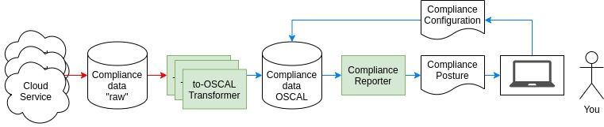

# Tutorial: What’s your compliance posture?

#### Introduction

The cloud with continuous integration and continuous deployment is the modern computing paradigm. There are a plethora of cloud environments: public, private, on-premise, hybrid-cloud, multi-cloud, etc. and a contingent of vendors. The cloud offers great flexibility where you can choose the right one or use some combination for the each application. But as is demonstrated from time to time, the cloud can be a dangerous place. Hackers, bots, malware, and more are out to find and exploit weakness in your computing solution. To combat them there are strategies for avoiding embarrassment and financial ruin from security breeches. Educating your workforce is of paramount importance. Moreover, employing a trust-but-verify strategy will go a long way toward deflecting trouble.

The time has come for continuous auditing, giving stakeholders such as account owners, application owners, system owners and compliance officers a current picture of their compliance posture.
Are password rules being followed? Are deployed applications using compromised encryption algorithms? Has a user gotten elevated privileges? Are unauthorized open source projects wrongfully part of your application stack?  Getting answers to these questions quarterly or annually is leaving you exposed.

Moreover, assuring continuous compliance across multiple cloud vendors can complicate matters. If each has its own compliance regime, then one must become expert in each domain’s compliance solution space, or else be wedded to a single or few providers. Not an ideal prospect.

Common sense dictates that standardization would simplify matters. The National Institute of Standards and Technologies (NIST) is developing the Open Security Controls Assessment Language ([OSCAL](https://pages.nist.gov/OSCAL)).

The compliance-[trestle](https://ibm.github.io/compliance-trestle/) open source github project is an effort to employ [OSCAL](https://pages.nist.gov/OSCAL) for compliance standardization and automation. Of great utility is the [trestle](https://ibm.github.io/compliance-trestle/) oscal module that facilitates transformation of data to/from Python object representations in accordance with the [OSCAL](https://pages.nist.gov/OSCAL) schemas.

#### Simple Continuous Compliance Architecture

Cloud Services can often be configured to monitor (and sometimes enforce) policies. Examples include OpenShift Compliance Operator and Tanium. However, the compliance reporting “raw” data produced is unique to each.

Two steps are needed to ascertain your compliance posture. Step 1 is to transform available compliance “raw” data into standardized form ([OSCAL](https://pages.nist.gov/OSCAL)). Step 2 is to examine the [OSCAL](https://pages.nist.gov/OSCAL) data and assemble a compliance posture for the controls and components of interest. And [trestle](https://ibm.github.io/compliance-trestle/) is the go-to solution.

#### Step 1 – Transformation

The bad news is that a transformer to [OSCAL](https://pages.nist.gov/OSCAL) is needed for each Cloud Service type.

However, there is plenty of good news:

- a transformer for your Cloud Service type may already exist: [Tanium to OSCAL](https://github.com/IBM/compliance-trestle/blob/main/trestle/tasks/tanium_to_oscal.py), [OpenShift Compliance Operator to OSCAL](https://github.com/IBM/compliance-trestle/blob/main/trestle/tasks/osco_to_oscal.py)
- once a transformer for a Cloud Service type has been written, it can be open-sourced/re-used
- writing a transformer is pretty easy, just a few lines of Python code using [trestle](https://ibm.github.io/compliance-trestle/) as a foundation

In the case of Tanium, the [OSCAL](https://pages.nist.gov/OSCAL) compliance data document is a *System Assessment Results* fragment with *Findings* and *Observations*, while in the case of OpenShift Compliance Operator there are *Observations* only.

Tutorials are available to show you: how to [run a transformer](https://ibm.github.io/compliance-trestle/tutorials/task.tanuim-to-oscal/transformation/), how to [write a transformer](https://ibm.github.io/compliance-trestle/tutorials/task.transformer-construction/transformer-construction/).

#### Step 2 – Reporting

Coming soon is a [trestle](https://ibm.github.io/compliance-trestle/) tool to assemble the [OSCAL](https://pages.nist.gov/OSCAL) fragments documents together using [OSCAL](https://pages.nist.gov/OSCAL) compliance configuration data (*System Assessment Plan*  and *System Security Plan*) into a complete *System Assessment Results*.
