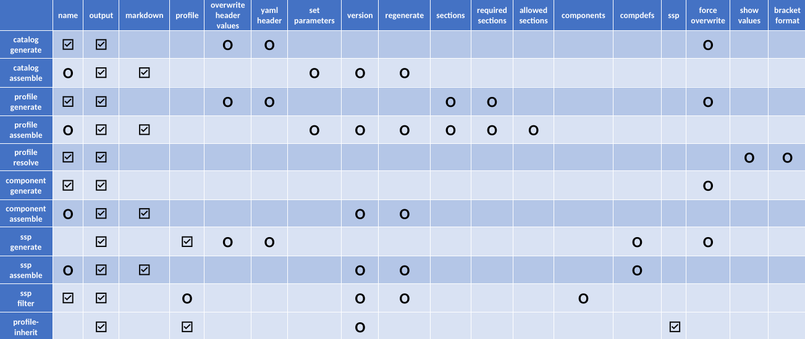

# Tutorial: Catalog, Profile, ComponentDefinition, and SSP Authoring

## Introduction and background

In addition to core functionality for automated processing of OSCAL documents, Trestle has authoring tools that allow conversion of OSCAL documents to markdown for easy editing - and conversion back to OSCAL for validation and automation.  A big part of compliance involves writing guidance prose associated with controls, along with the setting of parameters and properties for those controls.  This cannot be completely automated because it requires human editing, along with human approvals of those edits.  The purpose of the authoring tools is to allow selected edits of oscal documents guided by prompts for where content is required.  This serves to streamline the edit/approval process whereby the author is presented with one markdown document per control, and it provides a view of the the key information needed during the editing process.  This greatly simplifies the editing process compared to multiple authors working together on a single large JSON document.

The key modes of authoring are *-generate* and *-assemble*.  During *-generate* a JSON document is converted to markdown format, allowing authors to add or edit prose and parameter values.  After editing, the markdown can then be *-assemble*d into the same or a new JSON document that captures the edit changes.  In a normal authoring cycle, the markdown is generated for the first time from a given JSON file, and after that there is a continuous process of editing and reassembling to keep the JSON up to date with the markdown edits.

A third mode of authoring is *-filter*, where parts of a document are removed.  This allows one large master document to be represented in simpler ways with, e.g. proprietary prose culled in form intended for consumption outside a company.

<details markdown>

<summary>Integration with git and CI/CD</summary>

The command line interface in Trestle makes a powerful combination with git and CI/CD environments (Continuous Integration, Continuous Delivery or Deployment) when the trestle commands are performed via github actions or equivalent.  This allows different classes of users based on 1) their access to the repository 2) the changes to documents they are allowed to commit, and 3) the changes they can make to actions that are triggered by a commit.  As an example, a command line option may limit the type of content added to a profile, and if disallowed changes are detected during commit - the commit will be rejected.  This, in combination with having all controls as individual markdown files organized by groups in directories, makes management and tracking of author edits robust and automatically controlled by the built-in features of the respository.

For an example of actions triggered by a commit, a change to a control in a catalog could generate a pull request that is approved by someone with appropriate authority, and when it is later merged it triggers notification downstream to authors of profiles that import that catalog.

</details>

<details markdown>

<summary>The author commands</summary>

The author commands are:

1. `catalog-generate` converts a control Catalog to individual controls in markdown format for addition or editing of guidance prose and parameters, with parameters stored in a yaml header at the top of the markdown file.  `catalog-assemble` then gathers the prose and parameters and updates the controls in the Catalog to make a new OSCAL Catalog.
1. `profile-generate` takes a given Profile and converts the controls represented by its resolved profile catalog to individual controls in markdown format, with sections corresponding to the content that the Profile adds to the Catalog, along with both the current values of parameters in the resolved profile catalog - and the values that are being modified by the given profile's SetParameters.  The user may edit the content or add more, and `profile-assemble` then gathers the updated content and creates a new OSCAL Profile that includes those changes.
1. `profile-resolve` is special as an authoring tool because it does not involve markdown and instead it simply creates a JSON resolved profile catalog from a specified JSON profile in the trestle directory.  There are options to specify whether or not parameters get replace in the control prose or not, along with any special brackets that might be desired to indicate the parameters embedded in the prose.
1. `profile-inherit` takes a given parent profile and filters its contents based on the inherited controls included in a given ssp to be include in the final profile.
1. `component-generate` takes a given ComponentDefinition file and represents all the controls in markdown in separate directories for each Component in the file.  This allows editing of the prose on a per-component basis.  `component-assemble` then assembles the markdown for all controls in all component directories into a new, or the same, ComponentDefinition file.
1. `ssp-generate` takes a given Profile and an optional list of component-definitions, and represents the individual controls as markdown files with sections that prompt for prose regarding the implementation response for items in the statement of the control, with separate response sections for each component.  `ssp-assemble` then gathers the response sections and creates an OSCAL System Security Plan comprising the resolved profile catalog and the implementation responses for each component.  The list of component-definitions is optional, but without them the SSP will only have one component: `This System`.  Rules, parameters and status associated with the implemented requirements are stored in the SetParameters and Properties of the components in the component definitions and represented in the markdown, allowing changes to be made to the parameter values and status.  These edits are then included in the assembled SSP.  Note that the rules themselves may not be edited and strictly correspond to what is in the component definitions.
1. `ssp-filter` takes a given ssp and filters its contents based on the controls included in a provided profile, or in a list of components to be included in the final ssp.

In summary, the `catalog` tools allow conversion of a Catalog to markdown for editing - and back again to a Catalog.  The `profile` tools similarly convert a Profile's resolved profile catalog to markdown and allow conversion to a new Profile with modified additions that get applied in resolving the profile catalog.  `component` tools perform similarly for ComponentDefinitions.  Finally, the `ssp` tools allow the addition of implementation prose to the markdown of a system security plan, which is then assembled into a JSON SSP on a by-component basis.

Note that the original ssp implementation in trestle created SSP's by adding prose directly to the SSP markdown on a per-component basis, and there was no connection with separate ComponentDefinition JSON files.  This is now changed so that control responses can be added to the ComponentDefinition and then merged to create the SSP markdown.  In addition, rules and status are captured in the component definition as properties that propogate via markdown into the assembled SSP.  The OSCAL schema doesn't include a form of implementation status for components in the component definition, which is why trestle embeds the status value in the properties.  Similarly, rules and rule parameter values are not currently part of the schema, so they are also embedded in properties.

</details>

<details markdown>

<summary>Some details of the author commands</summary>

The markdown files for controls usually have a YAML header at the top containing metadata about the control.  Sometimes that information is read-only and intended as additional information useful during markdown editing, but in other cases the content may be edited and incorporated as new values for the control after `-assemble`.  In addition, most `-generate` commands allow specifying a separate YAML header file containing information either needed by the command, or intended to be incorporated into the header of each control markdown file.  When generating markdown a YAML header may be optionally provided, and if so, the option `--overwrite-header-values` will cause the values in the provided YAML header to overwrite the value in the markdown file's header for any items that are common.  Otherwise the provided YAML header will simply insert any values not already in the markdown header. By default, Trestle will preserve the history of the changes in generated markdowns, however `--force-overwrite` option can be used to overwrite markdowns with content from JSON. Note that this option will completely delete all existing markdowns (in the given `output` folder) without saving any changes. To save the changes, run assemble first.
Similarly, when assembling to JSON, the `--set-parameters` option will cause any changes in the header to take effect and change values in the assembled JSON for the control.  The changes can including setting parameter and property values.  The `--set-parameters` option is available only for `catalog-assemble` and `profile-assemble`.

As described earlier, the authoring tools are designed to work well in a CI/CD environment where changes are made in a pipeline by people with different responsibilities and authority.  In this setting, changes to documents can trigger changes downstream, e.g. the editing of a control would cause an update in the catalog, which could then flow down to an updated SSP.  These changes can occur automatically via actions that restrict the potential changes to the generated documents.  Examples are the `--set-parameters` option on the `-assemble` tools, and both `--required-sections` and `allowed-sections` for `profile-assemble`.  If a document change triggers an assemble action, changes to parameters can only occur if the action has `--set-parameters` in the command.  Similarly, `profile-assemble` will fail if the sections do not meet the requirements specified in the command options.  Another feature of the `-assemble` tools is that they won't create a new OSCAL file if the output already exists and its content would not be changed.  This prevents undesired triggering of downstream actions when there is no actual change in content.

There is a standalone demonstration of the SSP generation process with trestle in the [Trestle SSP Demo](https://github.com/IBM/compliance-trestle-ssp-demo) that captures the entire process of SSP authoring: from creation of a component definition from CSV file to a final formatted system security plan in Word (.docx) format.

</details>

<details markdown>

<summary>Background on underlying concepts</summary>

In order to understand the specific operations handled by these commands, it is helpful to clarify some of the underlying OSCAL structures and how they can be edited in markdown form.  This tutorial should be viewed in the context of the extensive documentation provided by [OSCAL](https://pages.nist.gov/OSCAL).

First, a *Catalog* is a collection of *Controls*, and a *Profile* imports controls and allows modification and additions to the controls, but it does not create new controls.  A Profile has one or more *Imports* that refer either to an actual Catalog, or another Profile that itself is importing from a Catalog or Profile.  The profiles can import controls selectively from each source and make additions or modifications to properties of the controls.  The final collection of selected and modified controls represents the profile's *resolved profile catalog*.

For clarity, here is a simple depicton of a catalog as a collection of controls:


Here is a profile pulling controls from a catalog to make a resolved profile catalog:


And here is a more complex situation where a single profile pulls controls from catalogs and profiles:


From the diagram it's clear that the profile is performing many tasks under the covers.  This is shown in an expanded view of a profile:


It's important to note that each profile is importing a selection of controls from each source, then making its own *suggested* modifications to parameters and other content in those controls.  They are suggested in the sense that downstream profiles may override those settings - with priority given to the later profiles in the pipeline.  The changes made by upstream profiles may be accepted, or overridden by better choices for a given need.  This way the catalogs themselves can remain relatively static, and individual use cases can effectively create a custom catalog based on the original controls plus modifications by  other static profiles, and/or the user's custom profile.  The authoring tools here provide ways to make those modifications, both to the catalog controls and to the profiles, and to enter the implementation responses that are needed in a System Security Plan.

The tools are designed to be used in a continuous `generate-edit-assemble` cycle, with previous edits retained in each cycle.  Each new edit phase can add or modify the current content, allowing a new `generate` of an OSCAL json document capturing those edits.

NOTE: We use `json` format for specifying OSCAL files in this tutorial, but it is equally applicable to `yaml` format also.

</details>

## The author commands for markdown generation and assembly (to JSON)

<details markdown>

<summary>trestle author catalog-generate and trestle author catalog-assemble</summary>

`catalog-generate` takes an existing json catalog and writes it out as markdown files for each control in a user-specified directory.  That directory will contain subdirectories for each group in the catalog, and those directories may contain subdirectories for groups within groups.  But controls containing controls are always split out into a series of controls in the same directory - and each control markdown file corresponds to a single control.

We now look at the contents of a typical control markdown file.

A Control may contain many parts, but only one of them is a Statement, which describes the function of the control.  The statement itself is broken down into separate items, each of which may contain parameter id's in "moustache" (`{{}}`) brackets.  Below is an example of a control as generated in markdown form by the `catalog-generate` command.

<details markdown>

<summary>Control example</summary>

```markdown
---
x-trestle-set-params:
  ac-1_prm_1:
    values:
      - new value
  ac-1_prm_2:
    values:
  ac-1_prm_3:
    values:
      - added param 3 value
  ac-1_prm_4:
    values:
  ac-1_prm_5:
    values:
  ac-1_prm_6:
    values:
  ac-1_prm_7:
    values:
x-trestle-global:
  sort-id: ac-01
---

# ac-1 - \[Access Control\] Policy and Procedures

## Control Statement

- \[a.\] Develop, document, and disseminate to {{ insert: param, ac-1_prm_1 }}:

  - \[1.\]  {{ insert: param, ac-1_prm_2 }} access control policy that:

    - \[(a)\] Addresses purpose, scope, roles, responsibilities, management commitment, coordination among organizational entities, and compliance; and
    - \[(b)\] Is consistent with applicable laws, executive orders, directives, regulations, policies, standards, and guidelines; and

  - \[2.\] Procedures to facilitate the implementation of the access control policy and the associated access controls;

- \[b.\] Designate an {{ insert: param, ac-1_prm_3 }} to manage the development, documentation, and dissemination of the access control policy and procedures; and

- \[c.\] Review and update the current access control:

  - \[1.\] Policy {{ insert: param, ac-1_prm_4 }} and following {{ insert: param, ac-1_prm_5 }}; and
  - \[2.\] Procedures {{ insert: param, ac-1_prm_6 }} and following {{ insert: param, ac-1_prm_7 }}.
- \[d\] My added item

## Control guidance

Access control policy and procedures address the controls in the AC family that are implemented within systems and organizations. The risk management strategy is an important factor in establishing such policies and procedures. 

```

</details>

The control markdown files rely on brackets around key items that are important in defining the control's properties and structure.  `\[Access Control\]` at the top indicates the title of the group containing the control.  The name of the control is already known from the name of the markdown file (`ac-1.md`) and the name of the group is already known from the name of the directory containing the group's controls (`ac`) - but the group title must be indicated in the control in a special manner, hence the brackets.  The text following the group title is the title of the control itself.  All controls in a group should have the same group title or a warning will be indicated in certain trestle operations.

In addition, each part label corresponds to the label used in the OSCAL structure for the control statement, and so must be maintained in a special manner -  hence the need for brackets on `\[(a)\]`.

The items in moustaches (`{{}}`) correspond to the original prose from the control description.  The moustaches represent places to substitue parameter values, but no substitutions are ever made until the final SSP generation.  The authoring process provides multiple ways to set and change the final parameter values, as described below.

`catalog-generate` is run with the command `trestle author catalog-generate --name catalog_name --output markdown_dir`, where `catalog_name` is the name of a catalog already loaded into the trestle workspace, and `markdown_dir` is the directory into which the markdown files for the controls will be written.  A separate directory is created for each group in the catalog.

A user then may edit the control statement for the control and add or change the contents.  In this case an added item, `My added item` is shown as item `d`.  You can then assemble the edited controls into a new catalog with the command `trestle author catalog-assemble --markdown markdown_dir --output new_catalog`.  This will load the updated control statements for each control into a new json or yaml catalog named `new_catalog`.

As with profile and ssp generation described below, a yaml header may be provided with the `--yaml` option that is inserted into the top of each control file.  If a control file already exists, as is expected in a continuous cycle of generate-edit-assemble, then the provided header will be merged with the existing header in each control.  If a given item in the header is already present in the control, by default the values in the markdown header will be given priority, though this can be overridden by the `--overwrite-header-values` option, which will give priority to any values coming from the provided yaml header.  In all cases, values in the yaml header not already present in the markdown header will be inserted.

In the control markdown example above, the header contains some arbitrary values along with a special `x-trestle-set-params` section containing parameters for some of the parameters in the control.  Any parameters for the control in the catalog will appear in the markdown header automatically during `catalog-generate`.  These values may be changed and values for other parameters may be inserted into the markdown header for later use during `catalog-assemble`.

Parameters in the header are shown with a subset of their full OSCAL attributes in order to convey any values they may have along with descriptive text.  This amounts to the parameter id, its label if present, any values if present, and any select if present.  When a select is present the list of choices is provided along with the how-many option.  Note that values is a list in OSCAL, but in many cases it is a list of only one item.  As a result, for convenience the values: dictionary may either have one string value (on the same line with `values:`) or as an indented `-` list of multiple values underneath `values:`.  Multiple examples are evident in the sample above, including ac-1_prm_3, which only has a label and no values.

Another important item in the header is the sort-id for the control.  This specifies how the controls and their parameters are ordered in any aggregated list operation.  If it is not specified for a control, the control's id is used for sorting.

As with the other -generate tools, the `--force-overwrite` option will cause the destination markdown directory to be erased prior to generating the new markdown, so that any prior edits to the markdown will be erased.

`catalog-assemble` is run with the command `catalog-assemble --markdown my_md --output my_new_catalog`.  This will read the markdown for each control and create a new catalog based on any edits to the markdown.  Note that you may optionally provide a `--name` option specifying an original json catalog into which the updated controls are inserted, and the resulting catalog can either replace the original one or output to a different json file.  New controls may be added but existing controls may not be removed and new groups cannot be added when you are updating an existing catalog.  The main benefit of updating an existing catalog is that the original metadata and other contents of the catalog json file will be retained.  Note that you cannot create new controls that contain controls, but if an original json catalog contains controls with child controls, you can edit and update all of them as individual markdown files.  You have the option to specify a new `--version` for the catalog, and an option to regenerate the uuid's in the catalog.  Finally, you have the option to use the parameters in the markdown header to update the values in the control.  Any parameters and their values present will be added to the control, and any not present will be removed.  The parameters themselves are still present but their values are removed.

In a typical `generate-edit-assemble` cycle, the cycle would start with an original json file containing source content and metadata and use that to generate an initial markdown directory of controls.  After editing the controls they would be assembled into into a new json file with a different name.  But once that new file exists, it can be used as the source for the next generation and the original source document is no longer needed or referred to.  For the `catalog-` editing cycle it would go as:

```
trestle author catalog-generate --name orig_catalog --output md_catalog
[user edits the markdown files]
trestle author catalog-assemble --name orig_catalog --markdown md_catalog --output assembled_catalog
[user makes additional markdown edits]
trestle author catalog-assemble --markdown md_catalog --output assembled_catalog
```

The key point here is that the first `-assemble` needs to use the original catalog for its metadata, backmatter and other items not captured in the markdown controls.  But once the output catalog has been created, by default it will be used as the "original" or "parent" catalog into which changes will be incorporated, unless a different source catalog is specified via `--name`.

Note that `catalog-assemble` can instantiate a catalog anew from a manually created directory of markdown controls in directories corresponding to groups, but the metadata in the assembled json catalog will contain many `REPLACE_ME` items that would need to be manually edited in the json file itself.  The trestle `split` and `merge` tools may help in that case.  Once the changes have been made they will be retained if a new `catalog-assemble` happens with that same output file as the target.

*Special Note about assemble*: In order to avoid triggering actions when a new file is created that has no actual changes in it, `catalog-assemble` and the other `-assemble` tools below will check to see if the output file already exists, and if so it will be examined for changes relative to the newly assembled one.  If there are no changes the file will not be written out.  Note that the check happens *before* any possible `--regeneration` of uuid's, and *after* any possible `--version` change.  This avoids the creation of a new file and new uuid's if there is no change to the version or other file contents relative to the existing output file, but if the specified `--version` is different from the one in the existing output file, or there is any other difference in the model, a new file will be written out.

</details>

<details markdown>

<summary>trestle author profile-generate and trestle author profile-assemble</summary>

The background text above conveys how a profile pulls controls from catalogs and makes modifications to them, and the `trestle profile` tools let you change the way those modifications are made.  In addition to selecting controls and setting parameters, a profile may add new parts to a control that provide additional guidance specific to a certain use case.  `profile-generate` is run with the command, `trestle author profile-generate --name profile_name --output markdown_dir`.  It will load the specified profile name from the trestle workspace (it must have been imported into the trestle workspace prior) and create its corresponding resolved profile catalog - but *without* applying any of its `Adds` of additonal guidance content or `SetParameters`.  It will make all other modifications, but the `Adds` and `SetParameters` are kept separate, as shown below:

<details markdown>

<summary>Example of control markdown after `profile-generate`</summary>

```markdown
---
x-trestle-set-params:
  # You may set values for parameters in the assembled Profile by adding
  #
  # profile-values:
  #   - value 1
  #   - value 2
  #
  # in the section under a parameter name
  # The values list refers to the values in the catalog, and the profile-values represent values
  # in SetParameters of the Profile.
  #
  ac-1_prm_1:
    label: label from edit
    profile-values:
      - all personnel
    values:
      - Param_1_value_in_catalog
    display-name: Pretty ac-1 prm 1
  ac-1_prm_2:
    profile-values:
      - Organization-level
      - System-level
    values:
    display-name: Pretty ac-1 prm 2
  ac-1_prm_3:
    profile-values:
      - new value
    values:
  ac-1_prm_4:
    profile-values:
    values:
  ac-1_prm_5:
    profile-values:
      - all meetings
    values:
  ac-1_prm_6:
    profile-values:
      - monthly
    values:
  ac-1_prm_7:
    values:
x-trestle-global:
  profile:
    title: Trestle test profile
  sort-id: ac-01
x-trestle-sections:
  guidance: Guidance
  implgdn: Implementation Guidance
  expevid: Expected Evidence
  my_guidance: My Guidance
  a_guidance: A Guidance
  b_guidance: B Guidance
  NeededExtra: Needed Extra
  a_subpart: A Subpart
  a_subsubpart: A Subsubpart
  b_subpart: B Subpart
  a_by_id_subpart: a by_id subpart
x-trestle-add-props:
  # Add or modify control properties here
  # Properties may be at the control or part level
  # Add control level properties like this:
  #   - name: ac1_new_prop
  #     value: new property value
  #
  # Add properties to a statement part like this, where "b." is the label of the target statement part
  #   - name: ac1_new_prop
  #     value: new property value
  #     smt-part: b.
  #
  - name: prop_with_ns
    value: prop with ns
    ns: https://my_new_namespace
  - name: prop_with_no_ns
    value: prop with no ns
    ns: https://my_added_namespace
---

---

# ac-1 - \[Access Control\] Policy and Procedures

## Control Statement

- \[a.\] Develop, document, and disseminate to {{ insert: param, ac-1_prm_1 }}:

  - \[1.\]  {{ insert: param, ac-1_prm_2 }} access control policy that:

    - \[(a)\] Addresses purpose, scope, roles, responsibilities, management commitment, coordination among organizational entities, and compliance; and
    - \[(b)\] Is consistent with applicable laws, executive orders, directives, regulations, policies, standards, and guidelines; and

  - \[2.\] Procedures to facilitate the implementation of the access control policy and the associated access controls;

- \[b.\] Designate an {{ insert: param, ac-1_prm_3 }} to manage the development, documentation, and dissemination of the access control policy and procedures; and

- \[c.\] Review and update the current access control:

  - \[1.\] Policy {{ insert: param, ac-1_prm_4 }} and following {{ insert: param, ac-1_prm_5 }}; and
  - \[2.\] Procedures {{ insert: param, ac-1_prm_6 }} and following {{ insert: param, ac-1_prm_7 }}.

## Control guidance

Access control policy and procedures address the controls in the AC family that are implemented within systems and organizations. The risk management strategy is an important factor in establishing such policies and procedures. Policies and procedures contribute to security and privacy assurance. Therefore, it is important that security and privacy programs collaborate on the development of access control policy and procedures. Security and privacy program policies and procedures at the organization level are preferable, in general, and may obviate the need for mission- or system-specific policies and procedures. The policy can be included as part of the general security and privacy policy or be represented by multiple policies reflecting the complex nature of organizations. Procedures can be established for security and privacy programs, for mission or business processes, and for systems, if needed. Procedures describe how the policies or controls are implemented and can be directed at the individual or role that is the object of the procedure. Procedures can be documented in system security and privacy plans or in one or more separate documents. Events that may precipitate an update to access control policy and procedures include assessment or audit findings, security incidents or breaches, or changes in laws, executive orders, directives, regulations, policies, standards, and guidelines. Simply restating controls does not constitute an organizational policy or procedure.

# Editable Content

<!-- Make additions and edits below -->
<!-- The above represents the contents of the control as received by the profile, prior to additions. -->
<!-- If the profile makes additions to the control, they will appear below. -->
<!-- The above markdown may not be edited but you may edit the content below, and/or introduce new additions to be made by the profile. -->
<!-- If there is a yaml header at the top, parameter values may be edited. Use --set-parameters to incorporate the changes during assembly. -->
<!-- The content here will then replace what is in the profile for this control, after running profile-assemble. -->
<!-- The added parts in the profile for this control are below.  You may edit them and/or add new ones. -->
<!-- Each addition must have a heading either of the form ## Control my_addition_name -->
<!-- or ## Part a. (where the a. refers to one of the control statement labels.) -->
<!-- "## Control" parts are new parts added after the statement part. -->
<!-- "## Part" parts are new subparts added into the existing top-level statement part with that label. -->
<!-- Subparts may be added with nested hash levels of the form ### My Subpart Name -->
<!-- underneath the parent ## Control or ## Part being added -->
<!-- See https://ibm.github.io/compliance-trestle/tutorials/ssp_profile_catalog_authoring/ssp_profile_catalog_authoring for guidance. -->

## Control Implementation Guidance

Do it carefully.

## Control Expected Evidence

Detailed logs.

## Control Needed Extra

Add prose here for required Section: Needed Extra

## Control A Guidance

Control level guidance

### A Subpart

A subpart prose

#### A Subsubpart

A subsubpart prose

### B Subpart

B subpart prose

## Part a.

### Subpart of top level Part a. of the control

Prose added as a sub-part to Part a. of the control

```

</details>

In the above markdown example, the fixed, uneditable parts of the control are output first (after the header, which can be edited), followed by a separate section marked, `Editable Content`.  And below the editable content are the individual `Adds` that the profile makes, with each one marked by a header of the form, `## Control guidance_name` or `## Part statement_part_label` followed by named subparts.  You may edit the editable content and you may add new Control guidance headers and statement sub-parts with your own new content. (Please refer to Markdown Specifications for Editable Content section below to learn more on which headers are valid in Trestle.) Then the command, `trestle author profile-assemble --name original_profile --markdown markdown_dir --output new_profile` will create a new OSCAL profile based on the original profile (specified) and the editable content in each control.

It's important to distinguish `## Control My New Guidance` from `## Part a.`.  Parts added with `## Control` will be new parts in the control added after the control statement, along with any subparts indicated by lower hash levels in that section.  In contrast, parts added with e.g. `## Part c.` will be added by-id to the _top level_ part in the control statement with label `c.`.  Thus "My New Guidance" is the title the user is assigning to a completely new part, while `c.` refers to a label corresponding the the desired control statement part.

When new part names are created in the markdown file the title is captured along with its capitalization and spaces, but the corresponding part name will be converted to snake case by default.  However, the user may indicate a specific mapping of the long title of the part to its actual part name by providing an entry in the `sections` provided during `profile-assemble`.  For example, in the above, the `Needed Extra` part would be assigned the name `needed_extra` but if you had a section entry such as `n_ex:Needed Extra` the name `n_ex` would be assigned in the assembled json profile, so that if you used that same section entry `trestle` would know to replace the `n_ex` part with `Needed Extra` in any generated markdown.

In a cyclic operation of `profile generate-edit-assemble` you would simply be re-writing from and to the same json profile, in which case the `--name` and `--output` are the same file.  For this reason the default value for `--name` is the given output file name specified by `--output` and you can just use `trestle author profile-assemble --markdown profile_md --output my_profile`.  This will assemble the markdown profile contents in directory `profile_md` into a json profile named `my_profile` but it will first use the existing `my_profile` json file as the parent profile and incorporate changes (due to user edits) in the markdown version of the profile.  Unlike `catalog-assemble` there must always be a parent json profile to reference during assemble, but like `catalog-assemble` an explicit value for `--name` is only needed if the parent file is different from the assembled output file.

It's important to note that these operations only apply to the `Adds` and `SetParameters` in the profile itself - and nothing upstream of the profile is affected.  Nor is anything else in the original profile lost or altered.  In the example above, the section, `## Control Implementation Guidance` was added by editing the generated control - and after `profile-assemble` it ended up as new guidance in the assembled profile.

As in the other commands, `profile-generate` allows specification of a yaml header with `--yaml-header`, support of the `--overwrite-header-values` flag and `--force-overwrite`.   Also, during assembly with `profile-assemble` the `--set-parameters` flag will set parameters in the profile for the control based on the header in the control markdown file.  But unlike with `catalog-assemble`, only those parameter values marked `profile-values` will be part of the assembled profile's SetParams when you assemble with the `--set-parameters` flag.  For each parameter, the "incoming" values for the parameters prior to any changes made by the profile are listed as `values:` and any pending changes made by the profile are listed as `profile-values:`.  If you don't use the `--set-parameters` flag then all the original SetParameters in the profile will be retained in the new, assembled profile.  But if you do set that flag, then only the header parameters with `profile-values:` will be added as SetParameters.  This lets you see all the incoming values for parameters along with any changes made by the current profile, and you can modify, add, or remove parameter settings as desired in the new profile.

The `x-trestle-add-props` key of the yaml header allows addition of properties to the SetParameters of the profile, comprising `name`, `value`, and optionally a namespace `ns` value.  The properties may be added at the control level, or attached to a top level statment part by adding a value, `smt-part` with value `a.`, `b.` or any other label for one of the top level statement parts.

For convenience, the `x-trestle-global` key of the yaml header contains the `profile-title` of the profile used to generate the markdown.

Keep in mind that the header in the `profile-` tools corresponds to the `SetParameters` in the profile - and not simply the `Parameters` in the control.  For convenience the current incoming values of the control parameters, as set by any upstream profiles, are shown as `values` - but anything else associated with a parameter, such as `profile-values`, `label`, `choice` will be added to the profile's `SetParameters` during `profile-assemble` (if you use the `--set-parameters` flag.)  So entries should be set there only if you want the profile to enforce those entries as `SetParameters`.

As with `catalog-assemble` described above, a new file is written out only if there are changes to the model relative to an existing output file, and during generate, `--force-overwrite` will first erase any existing markdown so that fresh markdown is created.

<details markdown>

<summary>Use of Sections in profile-generate and profile-assemble</summary>

The addition of guidance sections in the `profile` tools requires special handling because the corresponding parts have both a name and a title, where the name is a short form used as an id in the json schema, while the title is the readable form intended for final presentation.  An example is `ImplGuidance` vs. `Implementation Guidance`.  The trestle authoring tools strive to make the markdown as readable as possible, therefore the headings for sections use the title - which means somehow there is a need for a mapping from the short name to the long title for each section.  This mapping is provided in several ways:  During `profile-generate` you may provide a `--sections "ImplGuidance:Implementation Guidance,ExpEvidence:Expected Evidence"` option that would provide title values for `ImplGuidance` and `ExpEvidence`.  This dictionary mapping is then inserted into the yaml header of each control's markdown.  You may also add this mapping directly to a yaml file that is passed in during `profile-generate`, which is preferable if the list of sections is long.  The sections should be entered in the yaml header in a section titled, `x-trestle-sections`.

There is also a `--required-sections` option during both `profile-generate` and `profile-assemble`.  This option expects a list of sections as *comma-separated short names*, e.g. `--required-sections "ImplGuidance,ExpEvidence"`.  During `profile-generate` any required sections will have in the markdown a prompt created for guidance prose to be entered.  And during `profile-assemble` if required sections are specified, those sections must have prose filled in or it will fail with error.

Finally, `profile-assemble` also has an `--allowed-sections` option that restricts any added guidance to only those allowed sections - and if disallowed sections are present it will fail with error.  If `--allowed-sections` is not specified then any sections found in the markdown will be added to the assembled profile.

Note that these section options are all optional and there isn't a need to provide this form of restriction and enforcement.  But in order to have such sections read properly and mapped to the intended part names, a mapping must be provided in one of the ways described above.  And for certain workflows, if the allowed and required sections are specified by a command that is run as an action outside the user's control, it allows restriction of what changes can or must be made to a profile in terms of added guidance.

(Note that the single quotes are required on Unix-like systems, but on Windows they are only needed if the contained string includes spaces, in which case *double* quotes should be used.)

</details>

<details markdown>

<summary>Markdown Specifications for Editable Content.</summary>

For the ease of editing markdown in Github, Trestle's markdown parser follows [Github Flavoured Markdown (GFM) specifications](https://github.github.com/gfm/) and therefore only certain Control headers will be parsed and added to the control.

A valid control header in Trestle is the header that is correctly displayed as such when reading or previewing the edited markdown on Github website.

In GFM, headers are considered to be any line of text that has any number of `#` symbols at the beginning. For example those are all valid headers and will be treated as such by Github:

```markdown
# Valid header
## Valid header 
##### Valid header
# Valid <ins> header </ins> 
# Valid header <!-- some comment here -->
```

The headers above are valid Control headers and will be added to the control. However, there are multiple exceptions where the header will not be displayed. The header will not be displayed correctly if it is:

1. Written in the HTML comments `<!-- # not a header -->` or tags `<ins> # not a header </ins>` as well as multi-line comments:
   ```markdown
   <!--
   # not a header
   -->
   ```
   or multi-line HTML blocks:
   ```markdown
   <dl> # not a header
   # not a header
     <dt># not a header</dt>
   </dl>
   ```
1. Written in the single-line `# not a header` and multi-line code blocks:
   ```markdown
   # not a header 
   ```
1. Written in the links `[# not a header](url)`
1. Trestle will also not support headers inside the blockquotes `> # not a header`

In all cases above Trestle markdown parser will skip such headers and it will be not added to the control.

</details>
</details>

<details markdown>

<summary>trestle author profile-resolve</summary>

The `trestle author profile-resolve` command is different from the `generate/assemble` commands because it doesn't involve markdown and instead
it takes an input profile and creates the corresponding resolved profile catalog in `JSON` format.  In addition, it has several options for how
parameters are represented in prose of the controls, and whether or not those values are substituted.

As an example, the prose in the statement for control `AC-1` is:

`Develops, documents, and disseminates to {{ insert: param, ac-1_prm_1 }}:`

The parameter `ac-1_prm_1` has a label: `organization-defined personnel or roles` and it may or may not have a value assigned
by the profile being resolved.  Suppose it has been assigned the value, `my prm 1 value`.  In that case we can either leave the prose
as-is (with the parameter in "moustache" form) in the resolved catalog, or we can substitute the value, or we can substitute the descriptive label.  trestle
supports all these options, along with an optional prefix to specify whether a value has been assigned or not - typically using the name of the organization responsible.

The `--show-value -sv` option will cause the value for the parameter to be substituted in the prose if it is available - otherwise the list of selection options if
it has any, or simply the label prose if it has no options.

The `--value-assigned-prefix -vap` option adds a prefix to the value if the value is being assigned by the profile, and the `--value-not-assigned-prefix -vnap` will assign a prefix
to parameters that do not have values assigned, along with the descriptive parameter label.

Finally, the `--bracket-format -bf` option specifies how the parameter representation will be wrapped in braces.  The specification is done by placing characters around a single `.`
symbol representing the parameter string, e.g. `[.]` will place square brackets around the parameter.

Note that these options that specify how the parameter is represented all require `--show-value` to be True, otherwise the raw prose with the moustache is produced.

As an example, if we use options

`trestle author profile-resolve -n my_profile -o my_resolved_catalog -sv -bf [.] -vap "ACME Assignment:" -vnap "Assignment:"`

the above prose would become:

`Develops, documents, and disseminates to [ACME Assignment: my prm 1 value]:`

(Note that you need appropriate use of quotation marks in the command for any strings that include spaces or special characters.)

And if the parameter did not have a value assigned the result would be:

`Develops, documents, and disseminates to [Assignment: organization-defined personell or roles]:`

Finally, if the parameter already had a value specified in the catalog, the value would be shown by itself in braces:

`Develops, documents, and disseminates to [value in catalog]:`

Similar substitution happens when a parameter has choices that themselves reference a parameter, such as:

```markdown
"id": "ac-4.4_prm_1",
"select": {
  "how-many": "one-or-more",
  "choice": [
    "decrypting the information",
    "blocking the flow of the encrypted information",
    "terminating communications sessions attempting to pass encrypted information",
    " {{ insert: param, ac-4.4_prm_2 }} "
  ]
```

If the statement prose for AC-4.4 is:

`The information system prevents encrypted information from bypassing content-checking mechanisms by {{ insert: param, ac-4.4_prm_1 }}.`

and if a value `pulling the plug` has been assigned to ac-4.4_prm_2, the prose will be:

`The information system prevents encrypted information from bypassing content-checking mechanisms by [Selection (one or more): decrypting the information, blocking the flow of the encrypted information, terminating the communications sessions attempting to pass encrypted information, [ACME Assignment: pulling the plug]].`

There is a separate option from `--show-values` that will instead show only the descriptive labels for the parameters - again with an optional prefix.  The options are `--show-labels -sl`
and `--label-prefix -lp`.  Note that there is no need for "assigned" or "not assigned" because no values are being shown - just the labels.

If we resolve the profile with options `--show-labels --label-prefix "Label:" --bracket-format [.]` the resulting prose from earlier would be:

`Develops, documents, and disseminates to [Label: organization-defined personnel or roles]:`

and any value present for the parameter would be ignored.

Similar options apply to the `jinja` authoring commands.

</details>

<details markdown>

<summary>trestle author profile-inherit</summary>

The `trestle author profile-inherit` command is different from the `generate/assemble` commands because it doesn't involve markdown and instead
it takes an parent profile and ssp and creates child profile in `JSON` format.

When utilizing a process with leveraged authorizations, use the command `trestle author profile-inherit` to create a profile with initial content using a parent profile and SSP with inheritable controls. The provided and responsibility statements for all `by-component` fields, as well as the implementation status, will be used to evaluate the leveraged SSP.
To be filtered from the output profile (i.e. controls delta profile), all components must have exported provided statements, no exported responsibility statements, and an implementation status of `implemented`.

The filter command is invoked as:

`trestle author profile-inherit --profile my_parent --ssp my_leveraged_ssp --output controls_delta_profile`

Both the parent profile and the SSP must be present in the trestle workspace. This command produces a new workspace profile that imports the parent profile and filters the inherited controls from the SSP using the `exclude-controls` and `include-controls` fields in the profile import.

<details markdown>

<summary>Example imports generated from profile-inherit</summary>

```json
  "imports": [
      {
        "href": "trestle://profiles/controls_delta/profile.json",
        "include-controls": [
          {
            "with-ids": [
              "ac-2"
            ]
          }
        ],
        "exclude-controls": [
          {
            "with-ids": [
              "ac-1"
            ]
          }
        ]
      }
    ]
```

</details>
</details>

<details markdown>

<summary>trestle author component-generate and component-assemble</summary>

The `trestle author component-generate` command takes a JSON ComponentDefinition file and creates markdown for its controls in separate directories for each of the DefinedComponents in the file.  This allows specifying the implementation response and status for each component separately in separate markdown files for a control.  In addition, the markdown captures Rules in the control that specify descriptions and parameter values that apply to the expected responses.

The command has few options compared to other author commands and only requires specifying `--name` and `--output` for the ComponentDefinition and output markdown directory, respectively.

Here is an example of the generated markdown for the component `OSCO` in the ComponentDefinition file.  Note that this file will be under the subdirectory `OSCO/source_name` of the specified output directory - and any other DefinedComponents will have corresponding subdirectories level with the `OSCO` one.  Here `source_name` refers to the name of the profile or catalog in the ComponentDefinition that is the source for this control.  The control markdown files are written into directories split by both component name and source name.  If the source refers to a general uri and not a named profile or catalog in the trestle directory, then names such as `source_001` and `source_002` are assigned.  The actual source title can be found in the yaml header of any of the control markdown files.

<details markdown>

<summary>Example of control markdown after component-generate</summary>

```markdown
---
x-trestle-comp-def-rules:
  comp_aa:
    - name: top_shared_rule_1
      description: top shared rule 1 in aa
    - name: comp_rule_aa_1
      description: comp rule aa 1
x-trestle-rules-params:
  comp_aa:
    - name: shared_param_1
      description: shared param 1 in aa
      options: '["shared_param_1_aa_opt_1", "shared_param_1_aa_opt_2"]'
      rule-id: top_shared_rule_1
x-trestle-comp-def-rules-param-vals:
  # You may set new values for rule parameters by adding
  #
  # component-values:
  #   - value 1
  #   - value 2
  #
  # below a section of values:
  # The values list refers to the values as set by the components, and the component-values are the new values
  # to be placed in SetParameters of the component definition.
  #
  comp_aa:
    - name: shared_param_1
      values:
        - shared_param_1_aa_opt_1
x-trestle-param-values:
  ac-1_prm_1:
    - prof_aa val 1
  ac-1_prm_2:
  ac-1_prm_3:
  ac-1_prm_4:
  ac-1_prm_5:
  ac-1_prm_6:
  ac-1_prm_7:
x-trestle-global:
  profile:
    title: comp prof aa
    href: trestle://profiles/comp_prof_aa/profile.json
  sort-id: ac-01
---

# ac-1 - \[Access Control\] Policy and Procedures

## Control Statement

The organization:

- \[a.\] Develop, document, and disseminate to prof_aa val 1:

  - \[1.\] Organization-level; Mission/business process-level; System-level access control policy that:

    - \[(a)\] Addresses purpose, scope, roles, responsibilities, management commitment, coordination among organizational entities, and compliance; and
    - \[(b)\] Is consistent with applicable laws, executive orders, directives, regulations, policies, standards, and guidelines; and

  - \[2.\] Procedures to facilitate the implementation of the access control policy and the associated access controls;

- \[b.\] Designate an organization-defined official to manage the development, documentation, and dissemination of the access control policy and procedures; and

- \[c.\] Review and update the current access control:

  - \[1.\] Policy organization-defined frequency and following organization-defined events; and
  - \[2.\] Procedures organization-defined frequency and following organization-defined events.

## Control guidance

Access control policy and procedures address the controls in the AC family that are implemented within systems and organizations. The risk management strategy is an important factor in establishing such policies and procedures. Policies and procedures contribute to security and privacy assurance. Therefore, it is important that security and privacy programs collaborate on the development of access control policy and procedures. Security and privacy program policies and procedures at the organization level are preferable, in general, and may obviate the need for mission- or system-specific policies and procedures. The policy can be included as part of the general security and privacy policy or be represented by multiple policies reflecting the complex nature of organizations. Procedures can be established for security and privacy programs, for mission or business processes, and for systems, if needed. Procedures describe how the policies or controls are implemented and can be directed at the individual or role that is the object of the procedure. Procedures can be documented in system security and privacy plans or in one or more separate documents. Events that may precipitate an update to access control policy and procedures include assessment or audit findings, security incidents or breaches, or changes in laws, executive orders, directives, regulations, policies, standards, and guidelines. Simply restating controls does not constitute an organizational policy or procedure.

______________________________________________________________________

## What is the solution and how is it implemented?

<!-- For implementation status enter one of: implemented, partial, planned, alternative, not-applicable -->

<!-- Note that the list of rules under ### Rules: is read-only and changes will not be captured after assembly to JSON -->

imp req prose for ac-1 from comp aa

### Rules:

  - top_shared_rule_1

### Implementation Status: implemented

______________________________________________________________________

## Implementation for part a.

statement prose for part a. from comp aa

### Rules:

  - comp_rule_aa_1

### Implementation Status: partial

______________________________________________________________________

```

</details>

There is no direct way to specify rules in the ComponentDefinition, so they are specified via properties as shown here:

<details markdown>

<summary>Representation of rules in the props of a ComponentDefinition</summary>

```json
[
  {
    "name": "Rule_Id",
    "ns": "http://comp_ns",
    "value": "comp_rule_aa_1",
    "class": "Rule_Id",
    "remarks": "rule_2"
  },
  {
    "name": "Rule_Description",
    "ns": "http://comp_ns",
    "value": "comp rule aa 1",
    "remarks": "rule_2"
  },
  {
    "name": "Rule_Id",
    "ns": "http://comp_ns",
    "value": "comp_rule_aa_2",
    "class": "Rule_Id",
    "remarks": "rule_3"
  },
  {
    "name": "Rule_Description",
    "ns": "http://comp_ns",
    "value": "comp rule aa 2",
    "class": "Rule_Description",
    "remarks": "rule_3"
  },
  {
    "name": "Parameter_Id",
    "ns": "http://comp_ns",
    "value": "shared_param_1",
    "class": "Parameter_Id",
    "remarks": "rule_1"
  },
  {
    "name": "Parameter_Description",
    "ns": "http://comp_ns",
    "value": "shared param 1 in aa",
    "class": "Parameter_Description",
    "remarks": "rule_1"
  },
  {
    "name": "Parameter_Value_Alternatives",
    "ns": "http://comp_ns",
    "value": "[\"shared_param_1_aa_opt_1\", \"shared_param_1_aa_opt_2\"]",
    "class": "Parameter_Value_Alternatives",
    "remarks": "rule_1"
  }
],
"set-parameters": [
  {
    "param-id": "shared_param_1",
    "values": [
      "shared_param_1_aa_opt_1"
    ],
    "remarks": "set shared param aa 1"
  }
]
```

</details>

In this scheme the rules have a `Rule_Id` (e.g. `comp_rule_aa_1` in this example) and an associated tag (`rule_2`) in the `remarks` section that binds the name to the description: `Rule_Description`=`comp rule aa 1`.  In addition, rules may be associated with parameters specified here with `Parameter_id`=`shared_param_1`, `Parameter_Description`=`shared param 1 in aa`, and `Parameter_Value_Alternatives`=`[\"shared_param_1_aa_opt_1\", \"shared_param_1_aa_opt_2\"]`.  `Parameter_Value_Alternatives` corresponds to possible Choices for the parameter value.

Also shown in this JSON excerpt is a normal set-parameter used to set the value of a parameter associated with a rule id.  Thus the setting of the parameter follows the normal OSCAL schema for setting a parameter value, while the specification of the parameter and its options is specified via linked properties.

The markdown header lists all the rules that apply to this control, along with their descriptions, and for each implementation response, the rules that apply to it are shown.  The association of an ImplementedRequirement with a rule is again done with properties as shown here:

<details markdown>

<summary>Linking of ImplementedRequirement to a rule</summary>

```json
{
  "implemented-requirements": [
    {
      "uuid": "ca5ea4c5-ba51-4b1d-932a-5606891b7500",
      "control-id": "ac-1",
      "description": "imp req prose for ac-1 from comp aa",
      "props": [
        {
          "name": "Rule_Id",
          "value": "top_shared_rule_1"
        },
        {
          "name": "implementation-status",
          "value": "implemented"
        }
      ]
    }
  ]
}
```

</details>

The values for rule parameters are specified using the normal `SetParameter` mechanism in the ControlImplementation, but it's important to note that there are two different types of `SetParameter`: Those that apply to the normal parameters of the control, and those that apply strictly to the rules.

Note that markdown for a control is only created if there are rules associated with the control, and within the markdown the only parts written out that
prompt for responses are parts that have rules assigned.  Thus the output markdown directory may be highly pruned of both controls and groups of controls if only some controls have rules associated.

In addition, the rules should be regarded as read-only from the editing perspective, and you cannot change the rules associated with a control or its parts.  But you may edit the rule parameter values as described in the comments of the markdown file under
`x-trestle-comp-def-rules-param-vals`.  You may also edit the prose and implementation status associated with a statement part at the bottom of the markdown file.

`trestle author component-assemble`

The `component-assemble` command will assemble the markdown into a ComponentDefinition file containing all the DefinedComponents in the markdown, and as usual it can either overwrite the original JSON file or create a new one.  Edits made to the prose, status and rule parameter values in the markdown and header will be captured in the assembled file, but the list of rules attached with each ImplementedRequirement is *readonly* and new rule associations cannot be made via markdown.

</details>

<details markdown>

<summary>trestle author ssp-generate and trestle author ssp-assemble</summary>

The `ssp-generate` command creates markdown for an SSP (System Security Plan) from a profile, optional component definitions, and optional yaml header file.  `ssp-assemble` (described below) can then assemble the markdown files into a single json SSP file.  The profile contains a list of imports that are either a direct reference to a catalog, or an indirect reference via a profile.
There may be multiple imports of either type, and referenced profiles may themselves import either catalogs or profiles.  Each profile involved may specify
the controls that should be imported, along with any modifications to those controls.  This command internally creates a resolved profile catalog and generates a
directory containing a set of markdown files, one for each control in the resolved catalog.  Each markdown file has the optional yaml header embedded
at the start of the file.

The component definitions specify the components of the SSP, along with metadata associated with rules and status for the implemented requirements.  The rules, rule parameters, and status values are encoded by properties within the components as described above for `component-generate`.

Example usage for creation of the markdown:

`trestle author ssp-generate --profile my_prof --compdefs "compdef_a,compdef_b" --yaml /my_yaml_dir/header.yaml --output my_ssp`

In this example the profile and component definitions have previously been imported into the trestle directory.  The profile itself must be in the trestle directory, but the imported catalogs and profiles may be URI's with href's as described below.

The generated markdown output will be placed in the trestle subdirectory `my_ssp` with a subdirectory
for each control group.

If the imported catalogs or profiles are not at the URI pointed to by the Import href of the profile then the href should be changed using the `trestle href` command.

Similar to `catalog-generate`, the `--yaml` and `--overwrite-header-values` flag may be specified to let the input yaml header overwrite values already specified in the header of the control markdown file. Also, the `--force-overwrite` option can be used to overwrite markdowns with content from JSON.

The resulting files look like this:

<details markdown>

<summary>Example of control markdown after ssp-generate</summary>

```markdown
---
x-trestle-comp-def-rules:
  comp_aa:
    - name: top_shared_rule_1
      description: top shared rule 1 in aa
    - name: comp_rule_aa_1
      description: comp rule aa 1
  comp_ab:
    - name: top_shared_rule_1
      description: top shared rule 1 in ab
    - name: comp_rule_ab_1
      description: comp rule ab 1
  comp_ba:
    - name: top_shared_rule_1
      description: top shared rule 1 in ba
  comp_bb:
    - name: top_shared_rule_1
      description: top shared rule 1 in bb
x-trestle-rules-params:
  comp_aa:
    - name: shared_param_1
      description: shared param 1 in aa
      options: '["shared_param_1_aa_opt_1", "shared_param_1_aa_opt_2"]'
      rule-id: top_shared_rule_1
  comp_ab:
    - name: shared_param_1
      description: shared param 1 in ab
      options: '["shared_param_1_ab_opt_1", "shared_param_1_ab_opt_2"]'
      rule-id: top_shared_rule_1
  comp_ba:
    - name: shared_param_1
      description: shared param 1 in ba
      options: '["shared_param_1_ba_opt_1", "shared_param_1_ba_opt_2"]'
      rule-id: top_shared_rule_1
  comp_bb:
    - name: shared_param_1
      description: shared param 1 in bb
      options: '["shared_param_1_bb_opt_1", "shared_param_1_bb_opt_2"]'
      rule-id: top_shared_rule_1
x-trestle-comp-def-rules-param-vals:
  # You may set new values for rule parameters by adding
  #
  # ssp-values:
  #   - value 1
  #   - value 2
  #
  # below a section of values:
  # The values list refers to the values as set by the components, and the ssp-values are the new values
  # to be placed in SetParameters of the SSP.
  #
  comp_aa:
    - name: shared_param_1
      values:
        - shared_param_1_aa_opt_1
      ssp-values:
        - shared_param_1_aa_opt_2
  comp_ab:
    - name: shared_param_1
      values:
        - shared_param_1_ab_opt_2
x-trestle-set-params:
  # You may set values for parameters in the assembled SSP by adding
  #
  # ssp-values:
  #   - value 1
  #   - value 2
  #
  # below a section of values:
  # The values list refers to the values in the resolved profile catalog, and the ssp-values represent new values
  # to be placed in SetParameters of the SSP.
  #
  ac-1_prm_1:
    values:
      - comp_prof val 1
    display-name: AC-1 (a) (1)
  ac-1_prm_2:
    values:
  ac-1_prm_3:
    values:
  ac-1_prm_4:
    values:
  ac-1_prm_5:
    values:
  ac-1_prm_6:
    values:
  ac-1_prm_7:
    values:
x-trestle-global:
  profile:
    title: comp prof aa
    href: trestle://profiles/comp_prof/profile.json
  sort-id: ac-01
---

# ac-1 - \[Access Control\] Policy and Procedures

## Control Statement

The organization:

- \[a.\] Develop, document, and disseminate to [comp_prof val 1]:

  - \[1.\] [Organization-level; Mission/business process-level; System-level] access control policy that:

    - \[(a)\] Addresses purpose, scope, roles, responsibilities, management commitment, coordination among organizational entities, and compliance; and
    - \[(b)\] Is consistent with applicable laws, executive orders, directives, regulations, policies, standards, and guidelines; and

  - \[2.\] Procedures to facilitate the implementation of the access control policy and the associated access controls;

- \[b.\] Designate an [organization-defined official] to manage the development, documentation, and dissemination of the access control policy and procedures; and

- \[c.\] Review and update the current access control:

  - \[1.\] Policy [organization-defined frequency] and following [organization-defined events]; and
  - \[2.\] Procedures [organization-defined frequency] and following [organization-defined events].

## Control guidance

Access control policy and procedures address the controls in the AC family that are implemented within systems and organizations. The risk management strategy is an important factor in establishing such policies and procedures. Policies and procedures contribute to security and privacy assurance. Therefore, it is important that security and privacy programs collaborate on the development of access control policy and procedures. Security and privacy program policies and procedures at the organization level are preferable, in general, and may obviate the need for mission- or system-specific policies and procedures. The policy can be included as part of the general security and privacy policy or be represented by multiple policies reflecting the complex nature of organizations. Procedures can be established for security and privacy programs, for mission or business processes, and for systems, if needed. Procedures describe how the policies or controls are implemented and can be directed at the individual or role that is the object of the procedure. Procedures can be documented in system security and privacy plans or in one or more separate documents. Events that may precipitate an update to access control policy and procedures include assessment or audit findings, security incidents or breaches, or changes in laws, executive orders, directives, regulations, policies, standards, and guidelines. Simply restating controls does not constitute an organizational policy or procedure.

______________________________________________________________________

## What is the solution and how is it implemented?

<!-- For implementation status enter one of: implemented, partial, planned, alternative, not-applicable -->

<!-- Note that the list of rules under ### Rules: is read-only and changes will not be captured after assembly to JSON -->

### This System

<!-- Add implementation prose for the main This System component for control: ac-1 -->

#### Implementation Status: planned

### comp_aa

imp req prose for ac-1 from comp aa

#### Rules:

  - top_shared_rule_1

#### Implementation Status: implemented

### comp_ab

<!-- Add control implementation description here for control: ac-1 -->

#### Rules:

  - top_shared_rule_1

#### Implementation Status: implemented

______________________________________________________________________

## Implementation for part a.

### comp_aa

statement prose for part a. from comp aa

#### Rules:

  - comp_rule_aa_1

#### Implementation Status: partial

### comp_ab

<!-- Add control implementation description here for item a. -->

#### Rules:

  - comp_rule_ab_1

#### Implementation Status: partial

______________________________________________________________________
```

</details>

\
Each label in the ssp is wrapped in `\[ \]` to indicate it comes directly from the label in the control and is not generated by the markdown viewer.  Keep in mind that the actual label is the same but with the `\[ \]` removed.

Note that for each statement in the control description there is a corresponding response section in which to provide a detailed response for later inclusion in the final ssp as the control implementation.

Also note that the optional final sections are provided, and labeled using the title for the corresponding section.

In addition, this is the only control markdown where the moustache (`{{}}`) items have been replaced by the corresponding parameter values in the final resolved profile catalog, surrounded by brackets, so that the prose corresponds to the final intended control and its implementation.

The markdown can have guidance per-component in the control, as shown by the line, `### ACME Component`.  Any prose directly under a `##` implementation section will apply to the overall system component, but sections in a sub-header of the form `###` will only apply to that particular component.

After generating the markdown for the resolved profile catalog you may then edit the files and provide text in the sections with `Add control implementation...` in them.  But do not remove the horizontal rule
lines or modify/remove the lines with `### ` in them, corresponding to system components.

If you edit the control markdown files you may run `ssp-generate` again and your edits will not be overwritten.  When writing out the markdown for a control, any existing markdown for that control will be read and the response text for each part will be re-inserted into the new markdown file.  If the new markdown has added parts the original responses will be placed correctly in the new file, but if any part is removed from the source control json file then any corresponding prose will be lost after the next `ssp-generate`.

## `trestle author ssp-assemble`

After manually edting the markdown and providing the responses for the control implementation requirements, the markdown can be assembled into a single json SSP file with:

`trestle author ssp-assemble --markdown my_ssp --compdefs my_compdef_a,my_compdef_b --output my_json_ssp`

This will assemble the markdown files in the my_ssp directory and create a json SSP with name my_json_ssp in the system-security-plans directory.

As indicated for `ssp-generate`, please do not alter any of the horizontal rule lines or lines indicating the part or control id, e.g. `### ACME Component`.  You may run `ssp-generate` and `ssp-assemble` repeatedly for the same markdown directory, allowing a continuous editing and updating cycle.

As with all the `assemble` tools, you may optionally specify a `--name` for a corresponding json file into which the updates will be inserted, thereby preserving metadata and other aspects of the model.  The result can overwrite the provided model or get directed to a new model.  And the version may be updated and the uuid's regenerated.  As with the other `-assemble` tools, if an output file already exists, a new one will only be written if there are changes to the model relative to the existing file.  See `catalog-assemble` for more details.

If you do not specify component-defintions during assembly, the markdown should not refer to any components other than `This System`.  Thus you may first generate markdown with `ssp-generate` and no component-definitions specified - and then you may assemble that ssp with `ssp-assemble` and no component-definitions specified - but only if there are no components other than `This System` referenced in the markdown.  You may add new component implementation details to the markdown later, but any new components must be defined in a component-defintion file, and that file must be specified when `ssp-assemble` is run.

## Inheritance view

The inheritance view is generated by setting the `--leveraged-ssp` flag with `trestle author ssp-generate`. It contains information relating to exported information such as inherited capabilities and consumer responsibilities that can be used to populate the inheritance information in the assembled SSP. When used, a directory named "inheritance" is created within the markdown directory. This directory serves as a designated space for  mapping inherited capabilities and responsibilities onto components in the assemble SSP and authoring satisfied statements for responsibilities.

Example usage for creation of the markdown:

`trestle author ssp-generate --profile my_prof --compdefs "compdef_a,compdef_b" --yaml /my_yaml_dir/header.yaml --leveraged-ssp my_provider_ssp --output my_ssp`

In this example the leveraged ssp has previously been imported into the trestle directory, but it can be fetched from remote location.

The generated markdown output with the inheritance view will be placed in the trestle subdirectory `my_ssp/inheritance` with a subdirectory for each component in the leveraged ssp with directories separated by control and statement id below.

An example of this directory structure is below.

```text
.
 Application
    ac-1_stmt.a
       11111111-0000-4000-9009-001001002006.md
    ac-2.1
       11111111-0000-4000-9009-001001002004.md
    ac-2_stmt.a
        11111111-0000-4000-9009-002001002001_11111111-0000-4000-9009-002001002002.md
 This System
     ac-1_stmt.a
        11111111-0000-4000-9009-001002002001.md
     ac-2.1
        11111111-0000-4000-9009-001001002001.md
     ac-2_stmt.a
         11111111-0000-4000-9009-002001001001.md
```

The leveraged components are used as the top level directory to allow any non-leveraged components to be easily skipped or removed. Each markdown file is named in accordance with the uuid of the exported statement to ensure statement description updates can be applied.

There are three types of markdown files that can be generated from this process.

The examples below demonstrate these types:

<details markdown>

<summary>Example of inheritance provided only markdown after ssp-generate</summary>

```markdown
---
x-trestle-statement:
  # Add or modify leveraged SSP Statements here.
  provided-uuid: 11111111-0000-4000-9009-001002002001
x-trestle-leveraging-comp:
  # Leveraged statements can be optionally associated with components in this system.
  # Associate leveraged statements to Components of this system here:
  - name: REPLACE_ME
---

# Provided Statement Description

Consumer_appropriate description of what may be inherited.
```

</details>

<details markdown>

<summary>Example of inheritance consumer responsibility only markdown after ssp-generate</summary>

```markdown
---
x-trestle-statement:
  # Add or modify leveraged SSP Statements here.
  responsibility-uuid: 11111111-0000-4000-9009-002001001001
x-trestle-leveraging-comp:
  # Leveraged statements can be optionally associated with components in this system.
  # Associate leveraged statements to Components of this system here:
  - name: REPLACE_ME
---

# Responsibility Statement Description

Leveraging system's responsibilities with respect to inheriting this capability.

# Satisfied Statement Description

<!-- Use this section to explain how the inherited responsibility is being satisfied. -->
```

</details>

<details markdown>

<summary>Example of inheritance shared responsibility markdown after ssp-generate</summary>

```markdown
---
x-trestle-statement:
  # Add or modify leveraged SSP Statements here.
  provided-uuid: 11111111-0000-4000-9009-002001002001
  responsibility-uuid: 11111111-0000-4000-9009-002001002002
x-trestle-leveraging-comp:
  # Leveraged statements can be optionally associated with components in this system.
  # Associate leveraged statements to Components of this system here:
  - name: REPLACE_ME
---

# Provided Statement Description

Consumer-appropriate description of what may be inherited.

# Responsibility Statement Description

Leveraging system's responsibilities with respect to inheriting this capability.

# Satisfied Statement Description

<!-- Use this section to explain how the inherited responsibility is being satisfied. -->
```

</details>

Some additional information and tips about this markdown are below:

- Do not change the statement UUIDs in the YAML header. This is used in the assembled JSON to link the statements in the leveraged SSP to the components in the leveraging SSP.
- When mapping components in the YAML header, use the component title. If you do not wish to map a component to a particular inherited capability or responsibility, just leave the file as is. Files without mapped components or that contain the default "REPLACE ME" entry will be skipped.
- If the file exists, just the editable information will be preserved when regenerating existing inheritance view markdown. This includes the information under `Satisfied Statement Description` and the mapped components in the YAML header.

After manually editing the inheritance view markdown, the `trestle author ssp-assemble` command can be run without modifications for the inheritance view use case. During assemble, the inheritance directory is detected and the information will be assembled into the SSP. The by-component assemblies will be updated or added under existing implemented requirement or statement sections with the information from the markdown.

</details>

<details markdown>

<summary>trestle author ssp-filter</summary>

Once you have an SSP in the trestle directory you can filter its contents with a profile, list of components, list of implementation statuses, or list control origination values by using the command `trestle author ssp-filter`.  The SSP is assumed to contain a superset of the controls needed by the profile if a profile is specified, and the filter operation will generate a new SSP with only those controls needed by the profile.  If a list of component names is provided, only the specified components will appear in the system implementation of the ssp. If a list of implementation statuses is provided, controls with implementations including those statuses will appear in the control implementation of the ssp. Similarly, if a list of control origination values is provided, implemented requirements with a control origination property value included in the provided values will appear in the control implementation of the ssp.

The filter command is invoked as:

`trestle author ssp-filter --name my_ssp --profile my_profile --components comp_a:comp_b --implementation-status "planned,partial" --control-origination "customer-configured" --output my_culled_ssp`

The SSP must be present in the trestle workspace and, if filtering by profile, that profile must also be in the trestle workspace. This command will generate a new SSP in the workspace. If the profile makes reference to a control not in the SSP then the routine will fail with an error message.  Similarly, if one of the components is not present in the ssp the routine will also fail. The implementation statuses must be one of the allowed values as defined in the OSCAL SSP JSON format reference. Those include the following: implemented, partial, planned, alternative, and not-applicable. If an invalid value is provided, an error is returned. The control origination values also must be one of the allowed values as defined in the OSCAL SSP JSON format reference. Those include the following: system-specific, inherited, customer-configured, customer-provided, and organization. If an invalid value is provided, an error is returned.

</details>

<details markdown>

<summary>Summary of options used by the catalog, profile, component and ssp authoring tools.</summary>

The provided options for the generation and assembly of documents in the ssp workflow is rich and powerful, but can also be confusing.  To help see how they all relate please consult the following diagram showing the required and optional command line arguments for each command.  The checkboxes indicate required and the open circles represent optional.

The options shown are fairly consistent across the `-generate` and `-assemble` functions, but some clarification may be needed.  For `catalog-assemble` and `profile-assemble` you have the option to use an existing json file as a parent model into which new content is inserted - in memory - and the final model may either be written back into that same json file, or a different one - based on `--output`.  If you just want to keep editing and modifying the same original json file you can specify `--name` and `--output` to be the same, original json file.  But you could also direct it to a new json file while still using an original file as the "parent."  A key benefit of referencing an original json file is the resuse of metadata and backmatter - along with everything else separate from the controls.

`ssp-generate` is special because it starts with a profile rather than an ssp, whereas `catalog-generate` and `profile-generate` both start with a parent model of the same type.  Nonetheless, you still have an option during `ssp-assemble` to use a given json file as the template into which new content is inserted, and once again you may overwrite that original json file or direct it to a new one using `--output`.



</details>
