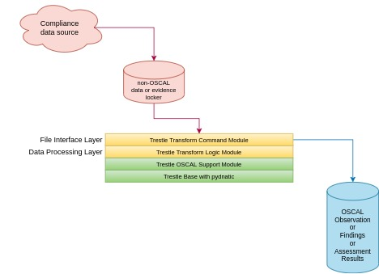
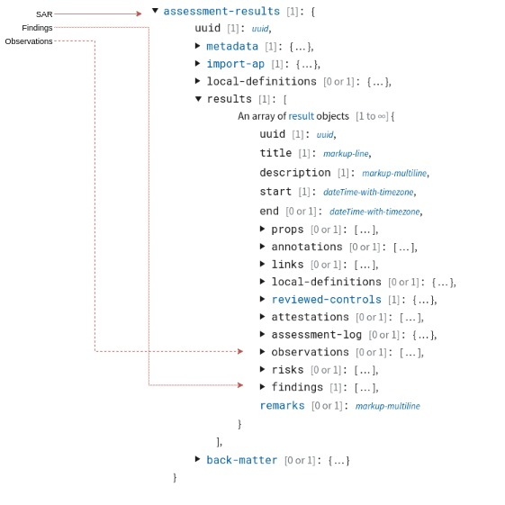

# Tutorial: How to build an Oscal Assessment Results "lite" with Trestle SDK from your posture result format

The compliance-trestle (trestle) project provides helpful modules to assist your standardization efforts.
Discussed below are some best practices for automated bridging to NIST OSCAL.

## *Why NIST OSCAL?*

The Open Security Controls Assessment Language [OSCAL](https://pages.nist.gov/OSCAL)
is a set of formats expressed in XML, JSON, and YAML that provide machine-readable representations of control catalogs, control baselines, system security plans, and assessment plans and results as adopted by the
National Institute of Standards and Technology [NIST](https://pages.nist.gov/).

Standardizing to OSCAL facilitates data interchange and understandability.

## *Objective*

The objective here is to transform your compliance data into valid OSCAL, in particular System Assessment Results
[SAR](https://pages.nist.gov/OSCAL/documentation/schema/assessment-results-layer/).

Examples of existing transformers  included with trestle are for the
OpenShift Compliance Operator [OSCO](https://github.com/IBM/compliance-trestle/blob/develop/trestle/tasks/osco_to_oscal.py) and
[Tanium](https://github.com/IBM/compliance-trestle/blob/develop/trestle/tasks/tanium_to_oscal.py).

## *Overview*

You have a source of compliance data that is in non-OSCAL format (spreadsheet, XML, JSON, database, object-store...)
and you would like to transform into standardized form in terms of NIST OSCAL.
Presumed is an existing method for obtaining the compliance data from the cloud and materializing on disk as one or more files.



- Source files on disk (pink) is our starting point.
- OSCAL files on disk (blue) is our ending point.
- OSCAL object management and emitter Python code are provided by trestle (green).
- Transformation Python code (yellow) is to be written by you.

Other possible code stack configurations (not shown):

- write your own command module (file interface), but use trestle logic module (data processing)
- write your own command and logic modules, but rely on trestle OSCAL support and base

For example, one could create an
auditree-arboretum [harvest](https://github.com/ComplianceAsCode/auditree-harvest#report-development)
report (file interface) that employs the trestle
osco-to-oscal transformation (data processing) module.

## *Choose Mapping Strategy*

There are 3 potential levels of OSCAL Assessment Results that can be emitted by your transformer.
From most complex to least complex they are:

- a complete SAR
- a partial SAR comprising Findings with Observations
- a partial SAR comprising Observations only

Below is a snippet from the [SAR](https://pages.nist.gov/OSCAL/documentation/schema/assessment-results-layer/) model
with these three levels shown.



Although producing a complete SAR is possible, this transformation is not covered here.
We focus on partial results, either Observations only or Observations with Findings.

Based on the data in hand from your compliance data source, and additional metadata that can be made available
at the time of transformation, choose the best fit.

##### Observations only

Emitting Observations only requires just rudimentary source data.
For example, if each instance of source data includes not much more than:

- inventory-name: ssg-ocp4-ds-cis-111.222.333.444-pod
- rule-name: xccdf_org.ssgproject.content_rule_scheduler_profiling_argument
- rule-result: fail

then the best mapping would be to an Observations only.

<details>
<summary>example snippet: instance suitable for mapping to Observation</summary>

```
data:
  <rule-result idref="xccdf_org.ssgproject.content_rule_scheduler_profiling_argument" time="2020-08-03T02:26:26+00:00" severity="low" weight="1.000000">
    <result>fail</result>
  </rule-result>
metadata:
  name: ssg-ocp4-ds-cis-111.222.333.444-pod
```

</details>

<details>
<summary>example snippet: instance OSCAL Observation</summary>

```
    {
      "uuid": "56666738-0f9a-4e38-9aac-c0fad00a5821",
      "title": "xccdf_org.ssgproject.content_rule_scheduler_profiling_argument",
      "description": "xccdf_org.ssgproject.content_rule_scheduler_profiling_argument",
      "methods": [
        "TEST-AUTOMATED"
      ],
      "subjects": [
        {
          "uuid-ref": "56666738-0f9a-4e38-9aac-c0fad00a5821",
          "type": "component",
          "title": "Red Hat OpenShift Kubernetes"
        },
        {
          "uuid-ref": "46aADFAC-A1fd-4Cf0-a6aA-d1AfAb3e0d3e",
          "type": "inventory-item",
          "title": "Pod",
          "props": [
            {
              "name": "target",
              "value": "kube-br7qsa3d0vceu2so1a90-roksopensca-default-0000026b.iks.mycorp"
            },
            {
              "name": "cluster-name",
              "value": "ROKS-OpenSCAP-1"
            },
            {
              "name": "cluster-type",
              "value": "openshift"
            },
            {
              "name": "cluster-region",
              "value": "us-south"
            }
          ]
        }
      ],
      "relevant-evidence": [
        {
          "href": "https://github.mycorp.com/degenaro/evidence-locker",
          "description": "Evidence location.",
          "props": [
            {
              "name": "rule",
              "ns": "dns://xccdf",
              "class": "id",
              "value": "xccdf_org.ssgproject.content_rule_scheduler_profiling_argument"
            },
            {
              "name": "time",
              "ns": "dns://xccdf",
              "class": "timestamp",
              "value": "2020-08-03T02:26:26+00:00"
            },
            {
              "name": "result",
              "ns": "dns://xccdf",
              "class": "result",
              "value": "fail"
            },
            {
              "name": "target",
              "ns": "dns://xccdf",
              "class": "target",
              "value": "kube-br7qsa3d0vceu2so1a90-roksopensca-default-0000026b.iks.mycorp"
            }
          ]
        }
      ]
    },
```

</details>

##### Findings with Observations

To additionally produce Findings, information about the controls associated with each rule-name is required.
The control information can be part of the source data itself or can be provided as one or more supplemental metadata files.

If each instance of source data includes:

- inventory-name: cmp-wn-2115.demo.tanium.local
- rule-name: xccdf_org.cisecurity.benchmarks_rule_19.7.44.2.1_L2_Ensure_Prevent_Codec_Download_is_set_to_Enabled
- rule-result: fail
- control-name: 800-53: SC-18

then the best mapping wound be to Findings with Observations.

<details>
<summary>example snippet: xml instance suitable for mapping to Finding with Observation</summary>

```

{"IP Address":"10.8.68.218",
  "Computer Name":"cmp-wn-2115.demo.tanium.local",
  "Comply - JovalCM Results[c2dc8749]":
    [{
      "Benchmark":"CIS Microsoft Windows 10 Enterprise Release 1803 Benchmark",
      "Benchmark Version":"1.5.0.1",
      "Profile":"Windows 10 - NIST 800-53",
      "ID":"xccdf_org.cisecurity.benchmarks_rule_19.7.44.2.1_L2_Ensure_Prevent_Codec_Download_is_set_to_Enabled",
      "Result":"fail",
      "Custom ID":"800-53: SC-18",
      "Version":"version: 1"
     }
    ],
  "Count":"1",
  "Age":"600"
}

```

</details>

<details>
<summary>example snippet: instance OSCAL Finding</summary>

```
      "findings": [
        {
          "uuid": "99c0a0de-e34e-4e22-95a1-1d4f24826565",
          "title": "800-53: IA-5",
          "description": "800-53: IA-5",
          "collected": "2021-03-16T13:29:14.000+00:00",
          "objective-status": {
            "props": [
              {
                "name": "profile",
                "ns": "dns://tanium",
                "class": "source",
                "value": "NIST 800-53"
              },
              {
                "name": "id-ref",
                "ns": "dns://tanium",
                "class": "source",
                "value": "IA-5"
              },
              {
                "name": "result",
                "ns": "dns://xccdf",
                "class": "STRVALUE",
                "value": "FAIL"
              }
            ],
            "status": "not-satisfied"
          },
          "related-observations": [
            {
              "observation-uuid": "61092735-e365-4638-bc2c-ecd0ed407e73"
            },
            {
              "observation-uuid": "95a20b8e-ed0a-4b6c-bf87-8789265c7158"
            },
```

</details>

<details>
<summary>example snippet: instance OSCAL Observation</summary>

```
      "observations": [
        {
          "uuid": "61092735-e365-4638-bc2c-ecd0ed407e73",
          "description": "xccdf_org.cisecurity.benchmarks_rule_1.1.1_L1_Ensure_Enforce_password_history_is_set_to_24_or_more_passwords",
          "props": [
            {
              "name": "benchmark",
              "ns": "dns://tanium",
              "class": "source",
              "value": "CIS Microsoft Windows 10 Enterprise Release 1803 Benchmark"
            },
            {
              "name": "rule",
              "ns": "dns://xccdf",
              "class": "id",
              "value": "xccdf_org.cisecurity.benchmarks_rule_1.1.1_L1_Ensure_Enforce_password_history_is_set_to_24_or_more_passwords"
            },
            {
              "name": "result",
              "ns": "dns://xccdf",
              "class": "result",
              "value": "pass"
            },
            {
              "name": "time",
              "ns": "dns://xccdf",
              "class": "timestamp",
              "value": "2021-03-16T13:29:14+00:00"
            }
          ],
          "methods": [
            "TEST-AUTOMATED"
          ],
          "subjects": [
            {
              "uuid-ref": "2650b9ba-e767-4381-9a3f-127d1552d7d2",
              "type": "inventory-item"
            }
          ]
```

</details>

<details>
<summary>example snippet: local definitions</summary>

```
"results": [
    {
      "uuid": "98028241-8705-4211-bf36-71e1f7aa6192",
      "title": "Tanium",
      "description": "Tanium",
      "start": "2021-03-16T13:29:14.000+00:00",
      "local-definitions": {
        "inventory-items": [
          {
            "uuid": "2650b9ba-e767-4381-9a3f-127d1552d7d2",
            "description": "inventory",
            "props": [
              {
                "name": "computer-name",
                "ns": "dns://tanium",
                "class": " inventory-item",
                "value": "cmp-wn-2106.demo.tanium.local"
              },
              {
                "name": "computer-ip",
                "ns": "dns://tanium",
                "class": " inventory-item",
                "value": "fe80::3cd5:564b:940e:49ab"
              },
              {
                "name": "profile",
                "ns": "dns://tanium",
                "class": " inventory-item",
                "value": "Windows 10"
              }
            ]
          },
```

</details>

## *Implement Mapping Strategy*

The best practice for building a transformer is to employ layers.
Recall that the top two layers (in yellow) are for you to implement,
while the bottom two layers (in green) are provided by trestle to assist you.

Trestle is a Python based multi-faceted platform that simplifies this task by providing a set of Python
classes which enforce adherence to the OSCAL schema, insuring that the produced OSCAL validates.

- file interfacing (read/write files)
- data processing (in-memory object structure construction)
- use of OSCAL versioned platform objects (trestle base and oscal functionality)

##### *File Interfacing*

Write a command line tool, for example a trestle task or
auditree-arboretum [harvest](https://github.com/ComplianceAsCode/auditree-harvest#report-development)
report that:

- imports the commensurate data processing module
- reads the input
- send input to data processing module
- receives transformed data from data processing module
- writes the output

##### *Data Processing*

Write a data processing module that receives data, and optionally metadata, for transformation from native form into OSCAL.
Separation from the command line file read/write mechanism allows for module re-use.

The module should:

- import the trestle oscal module
- receive input data to be transformed
- receive metadata, optionally
- transform input into trestle oscal classes hierarchy
- send transformed OSCAL data in return

For the Observation only case, the transform is straight forward. Code should create one Observation for
each rule/result pair.

For the Findings case, a bit more logic is required. Code should accumulate Observations for each Finding
and determine an overall status for it. For example, if 15 Observations are found for Finding control AC-3,
where 14 have result=PASS and 1 has result=FAIL, then the overall status for the Finding would be `not satisfied` with overall result=FAIL.

## *Examples*

There are 2 transformers in trestle.
The [osco-to-oscal](https://github.com/IBM/compliance-trestle/blob/develop/trestle/tasks/osco_to_oscal.py)
transformer emits OSCAL Observations, the simplest partial result.

The [tanium-to-oscal](https://github.com/IBM/compliance-trestle/blob/develop/trestle/tasks/tanium_to_oscal.py)
transformer emits OSCAL Findings, a more complex partial result.

Table of approximate lines of code.

<table>
<tr>
 <th style="text-align:right;border: 1px solid black;border-collapse: collapse;padding: 15px;background-color: #f1f1c1;">task-name
 <th style="text-align:right;border: 1px solid black;border-collapse: collapse;padding: 15px;background-color: #f1f1c1;">OSCAL type
 <th style="text-align:right;border: 1px solid black;border-collapse: collapse;padding: 15px;background-color: #f1f1c1;">file interface
 <th style="text-align:right;border: 1px solid black;border-collapse: collapse;padding: 15px;background-color: #f1f1c1;">data processing
 <th style="text-align:right;border: 1px solid black;border-collapse: collapse;padding: 15px;background-color: #f1f1c1;">test cases

<tr>
 <td style="text-align:right;border: 1px solid black;border-collapse: collapse;padding: 15px;">osco-to-oscal
 <td style="text-align:right;border: 1px solid black;border-collapse: collapse;padding: 15px;">Observations only
 <td style="text-align:right;border: 1px solid black;border-collapse: collapse;padding: 15px;">275
 <td style="text-align:right;border: 1px solid black;border-collapse: collapse;padding: 15px;">350
 <td style="text-align:right;border: 1px solid black;border-collapse: collapse;padding: 15px;">400

<tr>
 <td style="text-align:right;border: 1px solid black;border-collapse: collapse;padding: 15px;">tanum-to-oscal
 <td style="text-align:right;border: 1px solid black;border-collapse: collapse;padding: 15px;">Findings, with Observations
 <td style="text-align:right;border: 1px solid black;border-collapse: collapse;padding: 15px;">200
 <td style="text-align:right;border: 1px solid black;border-collapse: collapse;padding: 15px;">350
 <td style="text-align:right;border: 1px solid black;border-collapse: collapse;padding: 15px;">300
</table>

## *Contributing*

Consider contributing your transformer to
[trestle](https://github.com/IBM/compliance-trestle/blob/develop/CONTRIBUTING.md)
or
[auditree-arboretum](https://github.com/ComplianceAsCode/auditree-arboretum/blob/main/CONTRIBUTING.md)
or
other appropriate open source repository.
