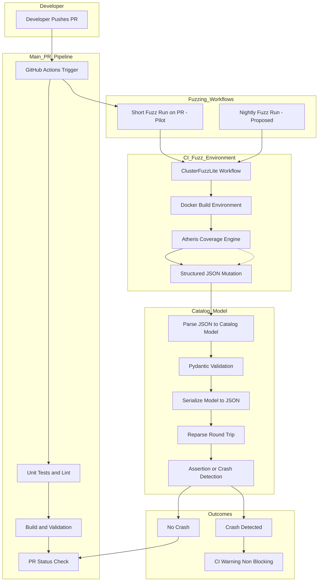

# RFC / Pilot: Continuous Structure-Aware Fuzzing for OSCAL Catalog

PR: [https://github.com/oscal-compass/compliance-trestle/pull/2080](https://github.com/oscal-compass/compliance-trestle/pull/2080)
Status: Pilot Implementation (PR #2080 Open) – 9 commits, CI failing, no reviews yet. Awaiting fixes, review, merge.
Target: trestle.oscal.catalog
Security Goal: OpenSSF Scorecard Fuzzing (10/10) – Contributes to closing #2018
Author: Rohan Dev (nXtCyberNeT)
Date: February 2026 (Prepared for Maintainer Community Call)

---

## 1. Executive Summary

This document describes the pilot implementation in PR #2080 for structure-aware, coverage-guided fuzzing in compliance-trestle, focused on the OSCAL Catalog model. Using Atheris for bytecode instrumentation and ClusterFuzzLite for GitHub Actions orchestration, the harness demonstrates round-trip idempotency testing and has already identified a real-world bug (AttributeError fixed via correct v1 API usage). Once CI is resolved, merged, and running continuously, it will contribute to achieving OpenSSF Fuzzing 10/10.

---

## 2. Current Status & Blockers

PR Progress: Open with 9 commits (including Dependabot dependency updates).

Key Achievement: Identified and resolved an AttributeError by standardizing Pydantic v1 API usage (parse_raw) within the harness.

Current Blockers:

* CI Pipeline Failures: Maintainer noted pipeline failures (see PR comment). Specifics include lint/status checks; pending local verification/fix.
* Normalization Drift: False positives in idempotency checks from Pydantic v1 quirks (whitespace/None/metadata handling).

Immediate Next Steps:

* Diagnose and fix pipeline failures (lint/status).
* Seek maintainer guidance on fix strategy (e.g., noqa exemptions if needed).
* Request 1–2 maintainer reviews for the Catalog harness.

---

## 3. Strategic Rationale

Atheris: Selected for native Python integration. Instruments the Python interpreter bytecode to track coverage within the Pydantic runtime.

ClusterFuzzLite (CFL): Chosen for zero external infrastructure requirements; execution and corpus storage occur entirely within GitHub Actions.

Pilot Scope: Implementation is strictly limited to the Catalog model to validate the round-trip assertion logic before wider package expansion. This addresses OpenSSF issue #2018 indirectly via a fuzzing baseline.

---

## 4. Architecture & Pipeline Flow

The following diagram illustrates the current non-blocking pilot flow implemented in PR #2080.

Note: Current PR #2080 implements only the short PR fuzz run (approximately 10 minutes, non-blocking warning via ClusterFuzzLite). Nightly and manual modes are proposed post-merge.

---

## 5. The Pydantic Paradox: Versioning Realities

An observed mismatch exists in API usage within the runtime environment.

Evidence: Codebase uses Pydantic v1-style methods (parse_raw, json) as confirmed by harness fix and model patterns. No v2 migration completed in core models.

Fuzzing Impact: Normalization drift (whitespace, None, metadata) causes frequent Model_A != Model_B even on semantically valid round-trips.

Mitigation: Non-blocking side-test mode and manual crash triage.

Future Recommendation: Adopt semantic diffing (e.g., deep dictionary comparison ignoring order and metadata) or align with any project-wide Pydantic v2 transition (e.g., model_validate_json).

---

## 6. Failure Modes & Implementation Details

Custom Mutator: Intercepts raw bytes to generate structured JSON dictionaries. Injects edge cases such as null in required fields, invalid UUID formats, excessive nesting depth (to trigger RecursionError), and malformed props or links.

Exception Categorization:

* Expected: ValidationError, json.JSONDecodeError (return silently).
* Critical: RecursionError, MemoryError, AttributeError, and explicit IdempotencyViolation (crash and report).

---

## 7. Execution Modes (Current vs. Proposed)

Mode: Short Fuzz Run
Trigger: Every PR
CI Impact (Current): Non-blocking warning
Purpose: Regression detection
Status: In PR #2080
Duration (Current): Approximately 10 minutes

Mode: Nightly Run
Trigger: Scheduled
CI Impact (Current): Not implemented
Purpose: Deep state-space exploration
Status: Proposed
Duration (Current): Not applicable

Mode: Manual Dispatch
Trigger: On-demand
CI Impact (Current): Not implemented
Purpose: Testing new schema versions
Status: Proposed
Duration (Current): Not applicable

---

## 8. Risks & Mitigations

Risk: High false-positive rate from Pydantic v1 serialization drift.
Mitigation: Maintain non-blocking status and implement semantic dictionary comparison ignoring metadata.

Risk: CI overhead and timeouts.
Mitigation: 10-minute cap on PR fuzz runs and usage of persistent corpus to resume exploration.

Risk: Limited coverage until expanded to other models (Profile and SSP).
Mitigation: Merge Catalog pilot first and use it as a baseline for incremental pull requests.

---

## 9. Proposed Next Steps

Immediate (Pre-merge):

* Diagnose and fix pipeline failures (lint and status checks) in PR #2080.
* Obtain 1–2 maintainer reviews or approvals.
* Squash-merge minimal Catalog harness as proof of concept.

Short-term (Next Pull Requests):

* Generalize harness into an OSCALHarness factory.
* Implement semantic comparison (e.g., deep dictionary comparison or custom equality ignoring metadata).
* Expand to Profile (inheritance and parameter logic) and SSP models.

Medium to Long-term:

* Add graph-level validation (back-matter UUID resolution, cycle detection, reachability).
* Document fuzz policy in SECURITY.md for OpenSSF 10/10.
* Explore nightly and manual modes via workflow dispatch and scheduled workflows.

---

